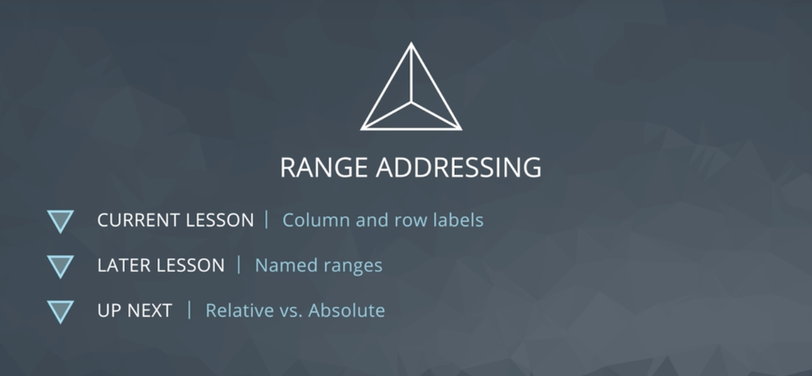
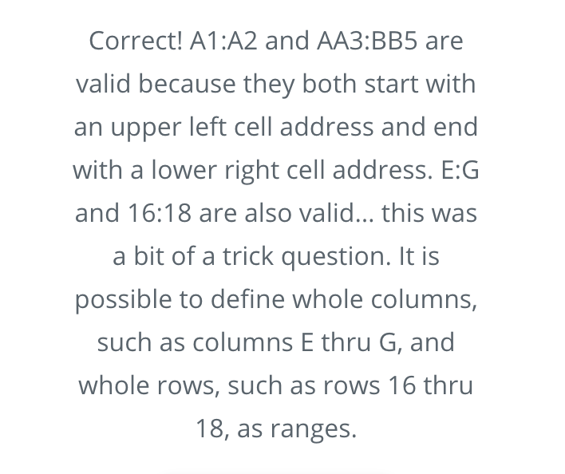
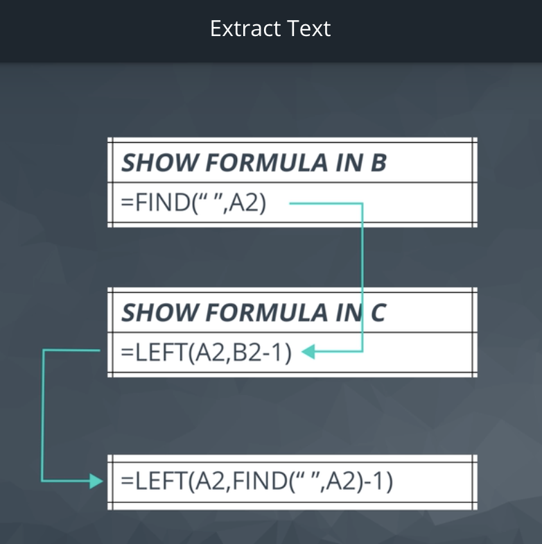

# Spreadsheets

## Spreadsheets 1

**Range**

**Relative vs Absolute Addressing**

- insert a `$` sign to denote `absolute`

[fruit-stand](./Misc/fruit-stand.xlsx)

## Spreadsheets 2

[substitute](./Misc/substitute.xlsx)

Extract text
[extract-text](./Misc/extract-text.xlsx)

Get Average
[fruit-sum-average](./Misc/fruit-sum-average.xlsx)

Remove duplicates
[world-cities](./Misc/worldcities.xlsx)

[world-cities](./Misc/worldcities-clean.xlsx)

Split Column Tip:
As you work with larger data sets, its can be helpful to "freeze" the header row or far left column as you scroll through data. To do this, use the View->Freeze Panes operation in Excel or View->Freeze in Google Sheets to select the rows or columns you want to always be visible.

[albb-salaries-2003](./Misc/albb-salaries-2003.xlsx)
