# Business Metrics

**Topics Covered**

1. **[Key Performance Indicators:](#key-performance-indicators)** We will start with a discussion about key performance indicators and how it differs by industries.

2. **[Business Process Flow:](#business-process-flow)** Then we will proceed to going through the business process flow across various business divisions. This will provide the context for learning about the business metrics.

3. **[Business metric:](#marketing-metric)** We will take on each business area, such as marketing and growth, and introduce you to a metric commonly used to measure success in that business area. We will discuss what each means, and how to calculate it. We will practice calculating the metrics and applying the metrics, and when and where to use the metric.

4. **[Distribution and central tendency:](#distribution-and-central-tendency)** We will circle back to the topic of data distribution that you learned about in the previous lesson, and why paying attention to the distribution of the data and to the choice of measure of central tendency is important.

5. **[Grouping data:](#grouping-data)** We will end with a discussion on how to look at the data across groups, cohorts, and time.

###[SUMMARY](#summary)

## Key Performance Indicators

Businesses need to be able to track how they are performing on key goals or objectives - whether they are growing number of customers, bringing down their costs, increasing revenue on an ongoing basis and myriad others. **Key Performance Indicators or KPIs** are how they measure their success on each of their key business objectives.

**Which KPI to use?**

>The decision regarding which KPI a business analyst should use depends on several factors, including which industry or domain they are working in, which business function they are focusing on, and the type of data they have available to them.

**Quiz**

For this next quiz, use the link below to answer the question:

https://kpidashboards.com/kpi/

**Steps to complete the quiz below:**

1. Click on the link above to get to the KPI Dashboards website
2. Scroll down to the header KPIs By Department.
3. You can view the KPIs for each department by clicking on View All next to the department name.
4. This website provides the KPIs for several industries. Use the website to identify the correct KPI for that industry.

**Asking Data Questions**

* Gather appropriate information to answer business problems
* What needs to change and communicate it clear with data

### Recap:

1. Identify business goal and questions.
2. Narrow down the type of data needed to answer questions.
3. Identify the KPIs that will be useful to show whether you are making progress on your business goal.
4. Conduct the data analysis using the KPIs and use visualizations as part of the analysis.
5. Provide recommendations and findings based on the completed data analysis.
6. Create succinct and visual presentations for the stakeholders.

**WeCart Case Study for this lesson**

To help you master the various concepts throughout this lesson, we will use a case study of an online app throughout this lesson. The online app is designed to pick up groceries from different stores and delivers it to the customer’s home. We will assume WeCart uses a subscription model where people set up accounts and place orders on a regular basis. You’ll find examples referencing WeCart throughout this lesson.

**Business Process Flow: Marketing**

**Business Process Flow: Growth**

The following video describes a typical question business analysts try to answer when they are considering issues of a company's growth. To grow the business, companies need to not only focus on existing customers, but also new customers. This problem is at the heart of growth metric. Executive boards, investors and sales teams are constantly keeping their eye on this critical question about a company's overall health.

**New Vocabulary**

**Call To Action**

A marketing term that refers to an action a website visitor is supposed to take when given a specific prompt on a website. These can be words or phrases, or icons that prompt and encourage the user to perform the action.

**Post-Purchase**

Actions customers take after purchasing an item that promote and increase sales and advocate on behalf of the company. For e.g., coming back and purchasing more items, sharing or liking the company or product on social media, taking pictures of the item and tagging it on Pinterest.

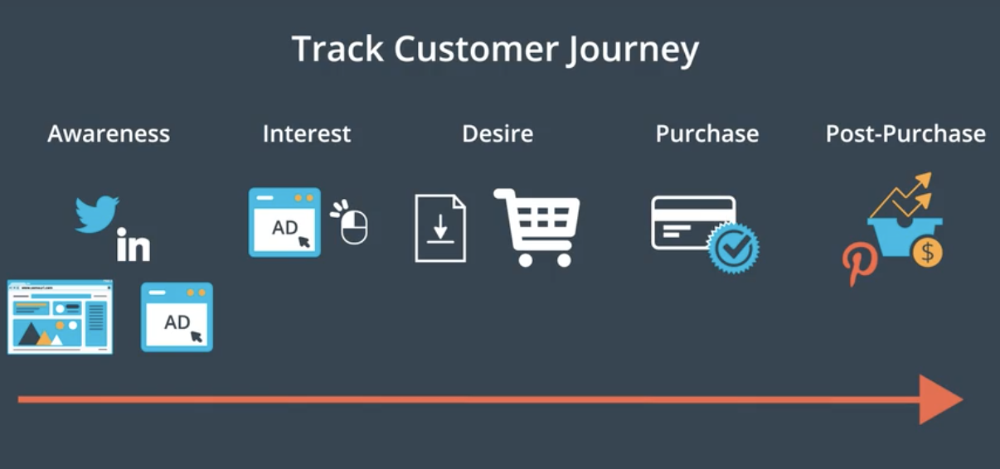

**Two Additional Levels**

Before we move on, I wanted to share 2 more levels that companies use.

**Loyalty**

To grow their revenue and company profits, companies don’t just want their customers to buy once from them, but to come back to their website. Especially if the product is not a high-priced product. That customer loyalty allows you to track how many revisits a customer is making after their first purchase, or how many of the customers have continued shopping after their first purchase.

**Metrics**:Some commonly used metrics include **Repeat Purchase Rate** and **Net Promoter Score**. We will not be going in depth with these, but please do check out the resources below to learn more about them.

**Advocacy**

Another level companies sometimes track is whether their customer is advocating for their company. That is, saying good things about the product and services. Leaning on social media provides a great opportunity to do just that.

**Metrics**: Some commonly used metrics include **Customer Referrals** and **Leads from Social Media**. For example, as the paid customer tweets about the company, likes the product on FB, provides a good rating on Amazon or the company website, analysts can use those metrics, such as ratings and likes to show how many of the customers serve as advocates.

We will not be going in depth with these last two stage levels, but we have provided some resources below to help you understand these more.

**New Vocabulary**

* **Search Engine Optimization (SEO)** : The goal of search engine optimization is to influence the frequency of a website appearing in response to specific search terms in a search engine. You can learn more about it on this [Wikipedia page](https://en.wikipedia.org/wiki/Search_engine_optimization) and this [Forbes article](https://www.forbes.com/sites/jaysondemers/2018/02/28/the-first-9-things-you-should-learn-in-seo/#7c150b7030f9).

* **Lead**: A potential customer interested in the products or services of a company.

* **Conversion**: When the lead (potential customer) purchases the products or services being sold by a company.

* **Repurchase Rate**: This [Medium blog](https://medium.com/@matsutton/repurchase-rate-the-most-overlooked-ecommerce-kpi-337bccde184b) describes how to calculate Repurchase Rate metrics.

* **Net Promoter Score**: This [Wikipedia page](https://en.wikipedia.org/wiki/Net_Promoter) describes the calculations and origin of NPS.

## Marketing Metric

#### [Click Through Rate (CTR)](#click-through-rate-ctr-1)
#### [Cost Per Click (CPC)](#cost-per-click-cpc-1)
#### [Cost Per Lead (CPL)](#cost-per-lead-cpl-1)
#### [Cost Per Acquisition (CPA)](#cost-per-acquisitioncpa)
#### [Cost Acquisition Cost (CPC)](#customer-acquisition-cost-cac)
#### [Lifetime Value](#lifetime-value-ltv)

### Marketing Funnel

  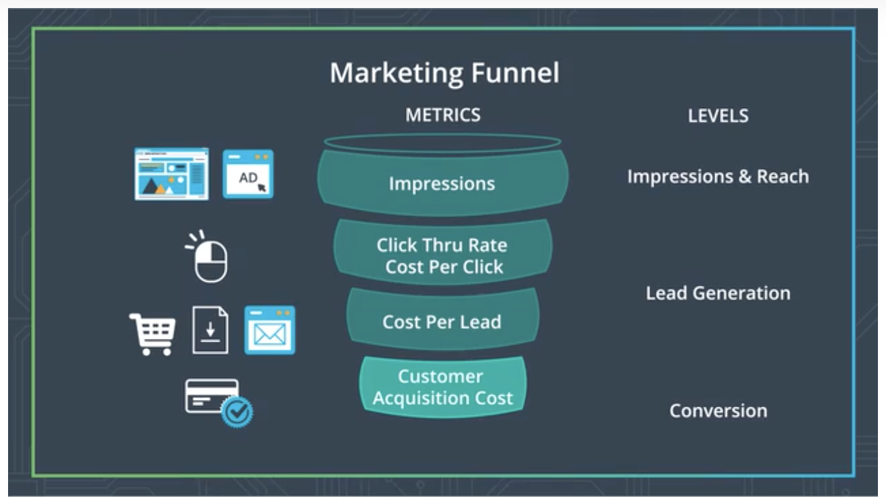

### Click Through Rate (CTR)                                          

*[Back to Marketing Metric](#marketing-metric)*

As potential customers view the ads, some of those potential customers will click the ad and be taken to the website for the company. To be counted at this level, the user needs to click through the ad and the metric we use here is **Click Through Rate**.

To calculate Click Through Rate, let’s cover a few key concepts. Make sure you are making a note of this terminology and definitions.

**Terminology**

- **Impressions** record an instance of an advertisement appearing on a website when it is viewed by a visitor. So if you visit the page 4 times, say in one hour, the gross impression count will include each repeated viewing.

- **Clicks**: Every time a website visitor views the ad and clicks it, this gets included in the Click count”

**Calculation**

`Click Through Rate = (Number of Clicks / Number of Impressions) X 100`

**Interpretation of CTR**

>The Click Through Rate is an informative metric that informs your marketing team whether they should try and increase the number of impressions or when they should reword the ad to increase clicks. Remember, if a person clicks through the ad, it does not mean the customer purchased, but rather they are showing interest in what the ad is about.

>When your CTR is low, your ad campaign is not generating enough interest. When the CTR increases, it is an indicator of an effective and interesting content in your ad campaign and that maybe you should increase the number of impressions for that ad.

**Benchmarks for CTRs for Google Ads across industries**.
Check out this blog that provides useful benchmarks for CTRs across industries: [Wordstream Blog](https://www.wordstream.com/blog/ws/2016/02/29/google-adwords-industry-benchmarks)

[Calculations](./Misc/band-marketingmetric-quizzes-a.xlsx)

#### Recap:

- **Click Through Rate (CTR)** = (Clicks/ Impressions) * 100 or Ratio of users clicking on a link or an ad to the number of total users who received the link or saw the ad.

- CTR measures the success of an advertising campaign or email campaign.

- When the CTR increases, it is an indicator of an effective and interesting content in your ad campaign and that maybe you should increase the number of impressions for that ad.

**Advanced Topics**

A related concept called **Unique Click Through Rate** is examined when looking at email campaigns to see how often a link sent through an email was opened by person receiving the email. If the person receiving the email clicks on the link 5 times, the unique CTR stays one, even though the total CTR is 5. Comparing the unique versus total CTR can help the analyst know if the email campaign reflects interest among potential customers.

We will not be going into unique CTR in detail in this lesson, but if you are interested in learning more about it, the following web pages are good resources for you to explore.

- [Mailigen website](https://www.mailigen.com/blog/email-campaign-click-through-rate-what-it-is-and-how-to-improve-it/)

- [Optimizely.com website](https://www.mailigen.com/blog/email-campaign-click-through-rate-what-it-is-and-how-to-improve-it/)

**New Vocabulary**

- **Impressions** : Impressions record an instance of an advertisement appearing on a website when it is viewed by a visitor.

**Business Metric Terminology and Formulas**

We have created a file with a list of business metrics covered in this lesson and their individual formulas - think of it as a cheat-sheet. You can locate it under the Resources tab on the top left under Lesson Resources. The file name is:

### [Business Metrics Lesson Terminology and Formulas](business-metrics-lesson-terminology-and-formulas-1.pdf).

### Cost Per Click (CPC)

*[Back to Marketing Metric](#marketing-metric)*

Cost Per Click refers to the cost to get a click on your ad. It helps us gauge the cost of advertising on the specific platform, so we can see which platform is generating more leads.

**Calculation**

`CPC = Cost of Advertising on Source Platform / Number of Viewers who Clicked on the Ad`

Since platforms charge you for the number of ads on a page, you can compare the CPC for the different platforms you are advertising on and see which platform is generating more interactions with your website, or generating more traffic to your website.

**Interpretation of CPC**

> Different ad platforms cost differently, and it is important to remember that while one platform might be cheaper it may not necessarily deliver you as many potential customers as another platform. This is an important tradeoff that analysts and marketing teams have to consider. Some marketing channels or platforms convert amazing results but they are small and may not generate as many customers. While you may decide to continue using them, you will also need to identify marketing channels that deliver more potential leads.

**Quiz**

Continue using the Smoothie Rocks CSV file named BAND_MarketingMetric_Quizzes_A. In case you need the file again, you can access it under the Resources at the end of the page. Calculate the necessary metrics to answer the quiz questions below.

[CTR, CPC, CPL](./Misc/band-marketingmetric-quizzes-a.xlsx)

#### Recap

- `Cost Per Click (CPC) = Cost of advertising on the source platform / Number of people who clicked on that ad`

- CPC is an indicator of the cost effectiveness of the ad platform and a useful tool to compare and strategize about which marketing platforms is yielding higher impression and reach and resulting in potential leads.

### Cost Per Lead (CPL)

*[Back to Marketing Metric](#marketing-metric)*

Remember, a **lead is when a potential customer visits your website and does something on the website in response to a prompt**, such as share their email , or download a document, create an account. Once the viewer takes that action, we know the viewer is showing some interest for the product or service, and this could possibly lead to a sale. **With Cost Per Lead we are tracking whether the potential customer turned into a lead within a given time period, that could be a 30-day window or 60-day window**.

Let’s go back to our funnel - we are tracking how much did it cost us to get the potential customer to take that action on the website. We are calculating the cost of generating interest and nurturing the interest of the potential customer and figuring out how much did it cost us to get them to get to this level? The metric we calculate is the Cost Per Lead.

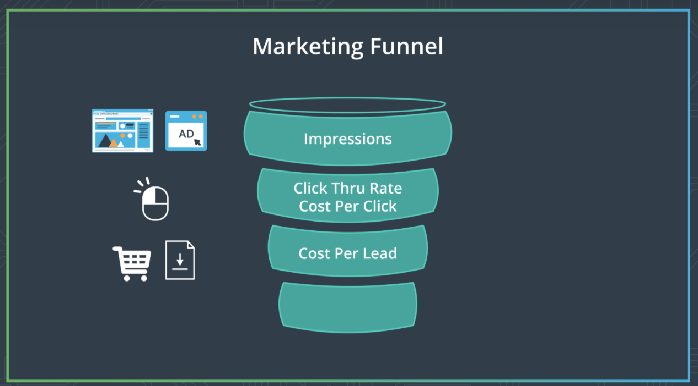

**Calculation**

`Cost Per Lead (CPL) = Cost of advertising on the source platform / Total number of leads`

**Interpretation of CPL**

> A lead is an indication that the advertisement or the advertising platform is targeting the right type of person. A low cost per lead means more of this particular type of person is likely to be interested in the product. Looking at the data in the video we can see that Google Display and Google Ads were comparable in terms of the Cost Per Lead. On the other hand, Facebook was costing us more to get to our potential customers. At the same time, Facebook also generated fewer clicks, so we need to consider if we need to tweak the ad for the Facebook platform, or consider other platforms that can generate same or higher number of clicks for a comparable price.

**Useful Resources and Links**
The following websites provide some benchmarks for Cost Per Lead by industries.

- [Marketing Charts](https://www.marketingcharts.com/customer-centric/lead-generation-and-management-79707)

- [Hubspot](https://research.hubspot.com/charts/cost-per-lead-benchmarks-by-industry)

**Quiz**
Continue using the Smoothie Rocks CSV file named BAND_MarketingMetric_Quizzes_A. We have provided a copy in the Resources below if you need it again. Calculate the necessary metrics to answer the quiz questions below.

[CTR, CPC, CPL](./Misc/band-marketingmetric-quizzes-a.xlsx)

#### Recap:
- `Cost Per Lead (CPL) = Cost of advertising on the source platform / Total number of leads`

- CPL is an indicator of the cost effectiveness of the ad platform and a useful tool to compare and strategize about which marketing platforms yielded more leads.

### Customer Acquisition Cost (CAC)

*[Back to Marketing Metric](#marketing-metric)*

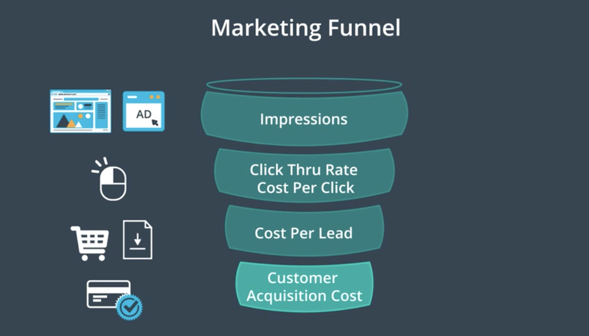

The goal is to increase customer conversion at the bottom of the funnel for the lowest cost.

**Good rule of thumb is 25% of revenue**

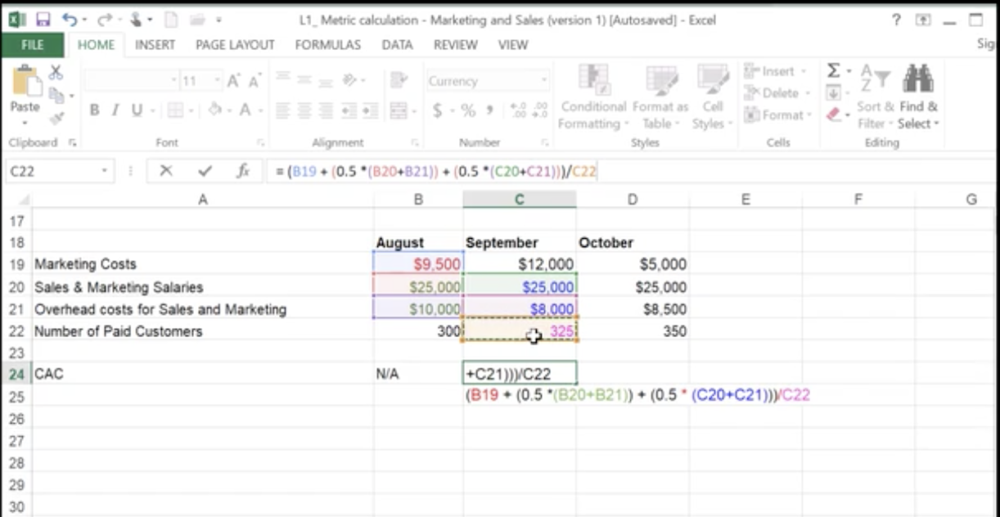

**Interpretation of CAC**

>The CAC metric is an indicator of how much it cost to acquire a customer. If your customer service team is doing a good job of keeping the paid customers happy, that can lead to future leads and paying customers, and thus keep the cost of acquiring customers low. The company's goal is to keep the CAC low, while increasing revenue as this has a positive impact on the profit margin and profits.

>Additional note regarding the timeline of the customer journey. If you are unsure of the timeline of your customer journey, think about when the ad was placed online, how long it was out, and when the ad was pulled out. That gives you a rough timeline of when you started getting paid customers, and estimate how much time an average customer took from seeing the ad to buying your product.

**Quiz**
Use the BAND Marketing Metric Quizzes B file in the Resources below to access the data to answer the following Quiz question. Once you have downloaded the Excel spreadsheet, calculate the appropriate metrics and then respond to the quiz question below.

>Because sometimes it takes time to convert customers, marketing campaigns may take some time to realize the revenue they are trying to generate. To account for this delay, its usually calculated on your average sales cycle.

**Formula for Calculating CAC with 60 day cycle**

[CAC w/ 60 day cycle](./Misc/band-marketingmetric-quizzes-b.xlxs)

#### Recap

- `Customer Acquisition Cost (CAC) = (Total marketing expenses + total sales expenses and salaries)/ # of customers acquired`

- The CAC formula can be modified with weighting for different months based on the length of the sale cycle.

- CAC is a useful metric used to get an estimate of how much it cost us to acquire the customer in the period the money was spent to reach out to them.

**Customer Acquisition Cost tells us the cost of acquiring a paid customer.**

### Optimizing Marketing Funnel

The goal with optimizing the funnel is to reduce the drop at each level. For example, if you find only 5% of the people seeing the ad click on the ad, it could be an indication that your ad needs more work and that you need to think about its relevance.

Further down the funnel, the goal of the marketing team is that once the leads or visitors are on the company website, the website design should cause no confusion to the visitor. There should be plenty of options available to stay engaged and the website, and there should be no confusion about what steps the visitor needs to take to make the purchase.

### Cost Per Acquisition(CPA)

*[Back to Marketing Metric](#marketing-metric)*

 **Acqusition** means non paying customer

**Interpretation of CPA**

>Cost Per Acquisition provides insight into whether or not the marketing campaigns are successful from a business perspective. For the purposes of calculating the CPA, the cost of the marketing campaigns should not be restricted to the cost of developing the ad, but also other costs of labor and overhead. In other words, CPA allows a business to gauge whether the marketing campaign is generating enough potential leads to cover a broader range of costs other than just direct advertisement costs.

**Recap:**

- `Cost Per Acquisition (CPA) = (Marketing and Sales Cost)/ number of new leads customers`

- CPA is referring to marketing + sales costs (overhead, salaries) in the numerator and includes only leads (non-paying customer) in the denominator.

- Here “acquisition” refers to a non-paying customer.

### [Lifetime Value (LTV)](https://www.youtube.com/watch?v=ZthlIc8wj2s)

*[Back to Marketing Metric](#marketing-metric)*

To identify high value customers to bring in more of this customers. A customer that will come back and continue to purchase.

This is the net profit we can attribute to a customer over the lenght of their relationship to the company.

`Lifetime Value (LTV) = Average Sale * Number of Repeat Sales * Expected Retention Time * Profit Margin`

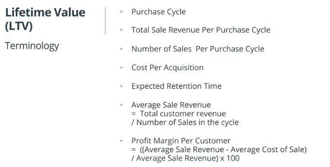

**Purchase cycle**

Time period that depicts general frequency of when a product is purchased

**Total Sale Revenue Per Purchase Cycle**

Revenue earned from all customers per purchase cycle

**Number of Sales Per Purchase Cycle**

Number of times the customer buys per purchase cycle

**Cost Per Acquisition**

Total cost of marketing and sales cost divided by the number of new leads

**Expected Retention Time**

Amount of time we expect to retain the customer measured by Purchase Cycle

> For example: A purchase cycle of 2 weeks in a year then ERT is 26.

**Average Sale Revenue**

Average revenue earned per transaction during the cycle.

`Average Sale Revenue = Total customer revenue/Number of Sales in the cycle`

**Average Cost of Sale**

Your cost of providing goods or services. Make sure to include your cost of customer acquisition (the amount it cost you to acquire this customer) as well as the cost of servicing this customer.

>Example: Each coffee Susan buys at $5.90 costs the company $4.65 (including cost of supplies, labor and marketing); Average Cost of Sale = $4.65

**Profit Margin Per Customer**

Percentage of sales that has turned into profits

`Profit Margin Per Customer = ((Average Sale Revenue - Average Cost of Sale)/Average Sale Revenue)*100`

Check out the following websites to read up on additional ways to calculate Lifetime Value:

1. [Multiple ways to calculate LTV](https://neilpatel.com/blog/how-to-calculate-lifetime-value/)
   

2. [Identifying your High value customers](https://www.intechnic.com/blog/how-to-calculate-customer-lifetime-value-clv-to-market-to-high-value-customers/)

3. [Using Cost of capital](https://abovecrowd.wordpress.com/2012/09/04/the-dangerous-seduction-of-the-lifetime-value-ltv-formula/)

**Quiz**

Calculate the Lifetime Value for Smoothie Rocks given the following information. An average purchase cycle of 2 weeks, with total sale revenue of $8 per order. The average customer order 5 orders per purchase cycle. The Cost per Acquisition is $7.50 and we expect to retain the customer for 3 years.

[Calculate Lifetime Value](./Misc/lifetime-value.xlsx)

#### Recap:

* `Lifetime Value (LTV) = Average Sale x Number of Repeat Sales x Expected Retention Time x Profit Margin`

* Items needed to calculate Life Time Value:
  - Purchase Cycle: The time increment adopted for business calculations
  - Total Sale Revenue Per Cycle: Revenue earned from customer per purchase cycle
  - Number of Sales Per Purchase Cycle: Number of times customer buys during the purchase cycle
  - `Cost Per Acquisition: (Cost of marketing and sales)/ number of new leads`
  - Expected Retention Time: Amount of time (measured in purchasing cycles) you expect to retain the customer.
  - `Average Sale Revenue: (Total customer revenue/ Number of purchases in the cycle) OR Average revenue received from the customer per transaction during the cycle`
  - `Profit Margin Per Customer: ((Average Sale - Average Cost of Sale) / Average Sale)`

* LTV takes into account future uncertainty around sales and is a good estimated guess about the future actions of the customer. It is important to use LTV as a tool to inform business strategy, and not a business strategy.

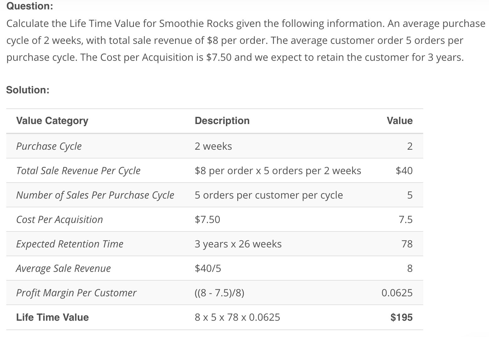

### [Interpreting Life Time Value](https://www.youtube.com/watch?v=NNKX-r-iPoI)

> Let's say you want to calculate the LTV of customers in 2016, you want to include all the purchases of that customer even in 2017 or whatever years. LTV takes in to account future uncertainty.

> Another to think in mind is the value of the actual product, most high value product will not be bought again and again it is more important to focus on each customer value instead of lifetime value.

## [Sales metric](https://www.youtube.com/watch?v=lsRIxIEHVCg)

#### [Business to Business (B2B)](#)
#### [Business to Consumer (B2C)](#)

**New Vocabulary**

* **Business to Business (B2B)**

  When one business makes a business transaction (goods or services) with another business. Often takes place when one business is providing source materials to the other business to in turn finally sell it to the consumer.

* **Business to Consumer (B2C)**

  When a business sells products and services to the final consumer.

## [Sales Conversion Funnel](https://www.youtube.com/watch?v=DqwsOwJCRqo)

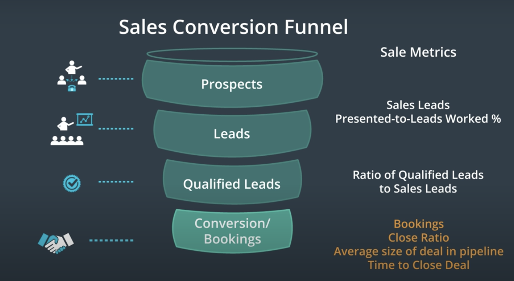

**New Vocabulary**

* **Sales Lead**

Sales leads refers to the number of potential customers who have shown interest or have been identified by the sales team member as being potentially interested in the product.

* **Qualified Lead**

A potential lead who has been vetted by the sales team as meeting key requirements of an ideal buyer. Sales teams check to see if the product offering is within the lead’s budget that will make them a viable buyer.

* **Booking**

Booking is a closed deal when the qualified buyer has committed to make the purchase. It is a key metric for tracking the success of the sales team.

* **Sales Pipeline**

Refers to the collection of steps a sales representative takes while navigating incoming leads or prospects through to making the final purchase. It is also used to track how well individual sales representatives are meeting their sales quota.

#### Recap

* **Sales Funnel**

Captures prospects, leads, qualified leads and bookings at each of the 4 levels in a sales funnel.

* **Sales leads**

Refers to the number of potential customers who have shown interest.

* **Qualified leads**

Refers to the vetted leads that meet the ideal buyer profile based on the sales team discussion *(potential factors to consider include, buyer budget requirements, and industry)*.

* **Bookings**

Is a closed deals, and a very important metric for tracking the success of the sales team.

* Sample sales metrics include **pipeline engagement, average size of deal in the pipeline, ratio of qualified leads to leads, and close ratio in pipeline**.

#### Additional Resources to learn more about Sales Metrics

* [Matrix Marketing Group](https://www.matrixmarketinggroup.com/sales-pipeline-key-metrics/) lists several sales specific metrics and provides definitions and how to calculate them

* [InsightSquared](https://www.insightsquared.com/2013/07/mythbusters-what-is-your-ideal-sales-pipeline-to-quota-ratio/) provides examples of visuals and lists additional sales metrics

### Total Bookings

Bookings is the most important sales metric. **Booking is a won deal that is signed or where the purchaser is committed to buying the product**. Once you have the sales bookings value, you can track it across specific time periods and even product lines.

**Calculation**

`[Total Bookings is the sum of all closed deals]`(https://www.youtube.com/watch?v=U4feV03HrTM)**

### [Average Deal Size (in $)](https://www.youtube.com/watch?v=o0EAWG-AxUI)
Another important metric to keep in mind is the Average Deal Size. This refers to the average deal size in dollars of all of the won deals. Reminder, a won deal is when the account buyer has committed to making the purchase.

**Calculation(https://www.youtube.com/watch?v=o0EAWG-AxUI)**

`Average Deal in Size ($) = Total ($) Sale Value of Deals or Orders / (#) of Orders over a Specific Period`

**Interpretation of Average Deal Size:**

As an analyst, you want to keep an eye out on the size of the deals you are winning, as any deal that is above this average deal size may involve more risk.The win rate for such sale prospects that are higher than the average deal size is usually low, but that doesn’t mean your sales rep shouldn’t pursue it. Rather these deals should be considered carefully for sales forecasting. Instead if you see the historical data shows your average deal size is increasing, your sales team can explore and go after lead generation efforts for larger deals. It is also a reminder for the team to understand what is bringing these larger deals into your pipeline.

#### Recap

`Average Deal Size = Total Sale Value of all Bookings / Total Number of Bookings`

### Average Time to Close

Average time to close deal is the average number of days it takes a member of the sales team to close the deal from the prospect stage to a closed deal.

This metric can be calculated for each sales team member, product, or lead source. **Lead source** refers to whether the prospect inquired through the website or had an **inbound** inquiry. On the other hand, **outbound** methods refers to cold-calling through email lists or phone calls. This means the customer has lower intent to purchase to begin with, and this lengthens the time to close the deal.

**Terminology**

* Sum of Total number of days from first contact to closing the deal for all closed deals

* `Average number of days for typical Sales Cycle = Sum(Total number of days to close deal) for all closed deals / Number of closed deals`

**[Calculation](https://www.youtube.com/watch?v=tIViOzc-5zk)**

1.`Sum (Total number of days from first contact to closing the deal)` for ALL closed deals.

2. `Average number of days for typical Sales Cycle = Sum (Total number of days from first contact to closing the deal) for ALL closed deals / Number of deals`

#### Recap:

1. `Calculate the number of days from first contact to closing the deal for EACH closed deal`

2. `Average number of days for typical Sales Cycle = Sum of number of days for all sales combined / Number of deals`

**Excel Function:**
`COUNTA` = Allows you to count the number of non-empty cells within an array

**Recap from Previous Lesson**
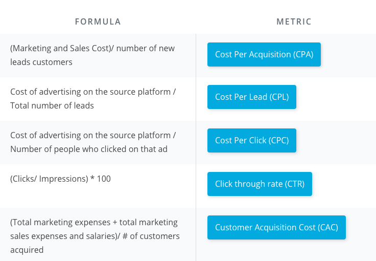

## [Growth Metrics](https://www.youtube.com/watch?v=hJTRdR0F_ag)

### [Monthly Active Users](#monthly-active-users-1)
### [Daily Active Users](#daily-active-users-1)
### [Stickiness](#stickiness-1)
### [Churn Rate](#churn-rate-1)

### [Engagement Metrics](https://www.youtube.com/watch?v=eukw3Bm-brk)

*Citation for original graph included in video: [Thoughts of Facebook's Q2 2015 Earnings](http://www.beyonddevic.es/2015/07/29/thoughts-on-facebooks-q2-2015-earnings/)*

#### Recap
* Engagement metrics are used to define the number of active users within a specific time period (ranging from daily, weekly to monthly).

### Monthly Active Users
Number of unique active users in the previous month

### Daily Active Users
Number of unique active users the previous day

### [Stickiness](https://www.youtube.com/watch?v=CvrqPRZ3ESY)

Are they Sticking around to use/consume?

**[Calculation video]**(https://www.youtube.com/watch?v=GtodhQLVFNo)

`Stickiness = Daily Active Users/Monthly Active Users`

**Interpretation of Stickiness Ratio**

> A 50% stickiness ratio indicates the average customer used the online app or website 15 of the 30 days in that month.

>In contrast, a .01 stickiness ratio indicates the average customer used the online app or website only one day that month.

>A higher stickiness ratio indicates the website or online app is engaging the customers.

**Quiz**

Please download the CSV file required to complete the next quiz below. You can find it under the Resources at the bottom of this page. The file name is BAND Stickiness Quiz.

[Stickiness Quiz](./Misc/band-stickiness-quiz.xlsx)

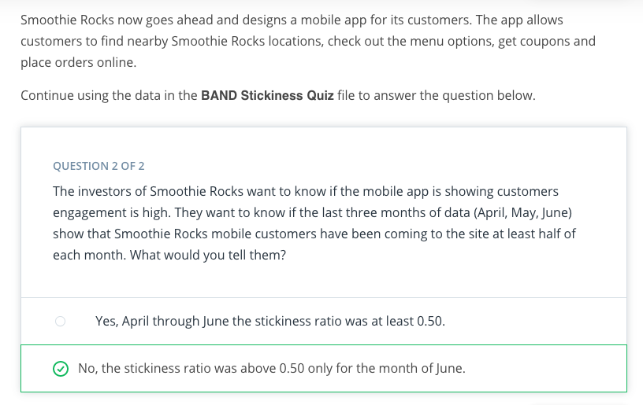

#### Recap:

* `Stickiness = Daily Active Users/ Monthly Active Users`

* It is a useful KPI for management and investors. It tells the management what is their company's growth rate. Investors want to know if this online app or website has potential to make money in the future.

>For example, if the plan is to introduce advertising into the app, the potential valuation will depend on whether the app has a large number of users that keep coming back to it.
Criticisms of Stickiness

It is important to note that there are also criticisms of some of these metrics. Let's review those for a moment:

1. One argument is that stickiness doesn't tease out the depth of engagement. It does not give much detail on what the users are doing. If the metric is based solely on whether users logged in, then it doesn't tell you if the user is just viewing, or using a website feature. When you are analyzing your website's engagement levels for a specific feature of your website, **stickiness cannot help you distinguish between engagement levels for specific features**.

2. In the start-up phase, not too much emphasis should be placed on this metric. It does not give an accurate metric of a reliable count of MAU because companies are in the marketing stage to get their name out.

3. Stickiness is **not** a useful metric when the app is not meant to be used monthly. For e.g., for a travel app where you need to book your flights for travel but since most people travel only a few times a year - at least for non-business purpose, this metric does not serve its purpose well.

### Churn Rate

**Churn Rate captures the number of people we retain at the end of a time period**.

Let's think about our online grocery delivery store WeCart. If customers don't renew their subscription, or request a refund, this impacts our growth. Thus to grow the business, we need to make sure we are retaining the customers we have already acquired. Churn Rate is often adopted by companies using a subscriber-based service model, especially in the telecommunication industry. In recent years, ecommerce and SaaS based companies have adopted the churn rate metric too.

To calculate the customer churn rate you need 2 simple things - Customers at the beginning of usage interval and Customers at the end of the usage interval. Just looking at these two numbers will tell you whether you end the interval with the same or fewer customers.

Important note: We only want to calculate the churn rate based on the customers we started the time interval with. When getting the number of customers at the end of the interval, we do NOT add the customers who converted during the interval . **Churn rate should only tell you whether the current customers have left or stayed**.

**[Calculation](https://www.youtube.com/watch?v=b6RyLycx-hI)**

`Customer Churn Rate = (Customers at the beginning of usage interval - Customers at the end of usage interval) / Customers at the beginning of usage interval`

**Terminology**

* **Usage Interval**: This time period should make sense for the service or product the customers are using. It can range from a day, a week, to a month or quarter. It depends on the service or product the company is providing and how often you would expect a customer to be active on the website.

>For e.g., WeCart is an online grocery business, so we would expect an existing customer to place at least 1 order over a month. We will use the usage interval of 1 month. If the customer has not placed any order over the course of a month, we can count that customer as having churned. Once we have identified these users as having churned, we can focus on the efforts to bring them back to the website and make the active again.

**Interpretation of Churn Rate**

While the churn rate is inevitable, **in general an annual churn rate of 5% is seen as a reasonable benchmark**. Keep in mind that the range for **churn rates is wider for B2C companies**.

As you calculate your annual churn rate, keep in mind a few other "data assumptions" that you need to watch out for.

1. Select a time interval during which you calculate the churn rate is consistent with the company's subscription or usage model. There is no ideal usage interval - **the usage interval depends on the length of time the company expects the user to be active at least once**.

2. Pay attention to different customer segments, especially if they have different churn rates (e.g., by region).

3. Make sure your data **does not include new customers gained during the time interval**. **Churn rate is focusing on customers who stayed or are active vs. stop being active on the website**.

**Additional Resources**

* **[Chaotic Flow](http://chaotic-flow.com/saas-metrics-faqs-what-is-churn/)**: Nice article on what data considerations one should keep in mind when calculating annual churn rate.

* **[Six Ventures](https://sixteenventures.com/saas-churn-rate)**: A blog on differentiating between 5% annual vs. 5% monthly churn rate.

* **[Recurly](https://info.recurly.com/research/churn-rate-benchmarks)**: This website talks about benchmarks for Churn rate across industries, so check those out to learn about industry specific churn rates.

**Quiz**

For the following quiz, please download the corresponding file BAND Churn Rate Quiz. You can download the file by clicking under the Resources at the bottom of the page.

[Churn Rate](./Misc/band-churn-rate-quiz.xlsx)

#### Recap:
* `Churn Rate = (Customers beginning of usage interval - Customers end of usage interval) / Customers beginning of usage interval`

* **Churn rate is a measure of declining growth**. Business need to make sure that they are acquiring new customers at a rate faster than their "churn rate"
* Growth rate is a measure of new customers being added in the usage interval.

**New Vocabulary**

* **Software as a service (SaaS)**: SaaS is a software distribution model in which the application is made available on servers hosted by a third-party provider, which in turn provides the software to customers over the Internet.

* **Subscribed based service model**: Subscribed based service model is a model where consumers agree to pay a subscription fee to gain access to the service or product.

## [Finance Metrics](https://www.youtube.com/watch?v=2qKKI_hf0vs)

### [Profit & Loss Statement](#profit-&-loss-statement)
### [Gross Margin](#gross-margin)
### [Contribution Margin](#contribution-margin)

**Financial Metrics**

Now we shift our attention to Financial Metrics.

When you look at the financial metrics, you are focusing on tracking your performance against your company’s financial goal. You are trying to answer the following questions.

* How is your revenue comparing to the costs?
* How are sales trending against sales goals?
* How are sale and marketing lead metrics comparing against acquisitions?

The video above provide you with the basic information about financial metrics. There are entire graduate degrees people take to master as part of financial metrics. We have provided some additional information below the videos to give you more information about each metric. But if you find this interesting, you should definitely explore your career options more!

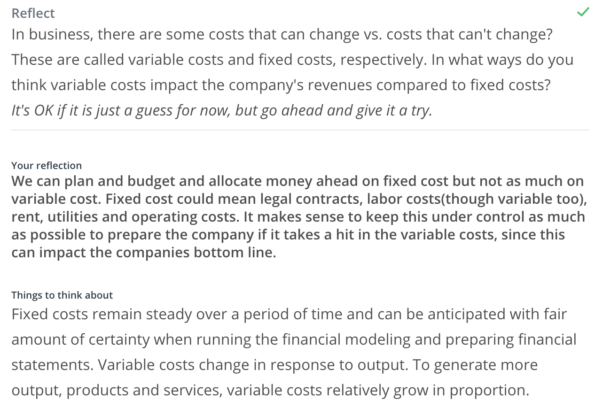

**Useful Resources and Websites to Learn More About Finance and Accounting**

1. [Difference between Finance and Accounting](https://corporatefinanceinstitute.com/resources/careers/jobs/finance-vs-accounting/)
2. [Careers in Finance](https://www.businessadministrationinformation.com/finance/the-difference-between-finance-and-accounting-degrees)

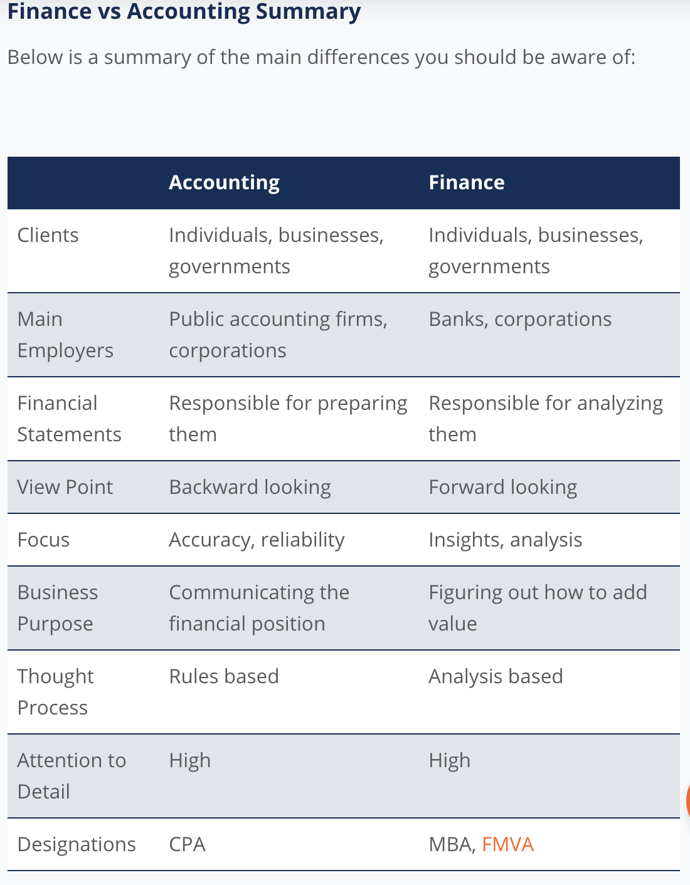

### Profit & Loss Statement

#### Items in Profit and Loss Statement

The following list is a breakdown of the individual items within the Profit and Loss Statement.

**Revenues**

  The money a company makes from the sales of its products and services.

**Cost of Goods Sold (COGS) or Cost of Sales**

  These are the direct costs the company incurs to develop the product or service being sold.

**Gross Profit**

  The difference between the revenue earned and the costs summarized in COGS.

**Gross Profit = Revenue - COGS**

**Selling, General and Administrative expenses (SGAs): Includes the following expenses:**

    * Marketing, sale commissions
    * Salaries for office staff
    * Supplies and computer hardware
    * Note: Some companies list total operating expenses separately from SGAS while others treat them as synonymous with SGAS.

**Operating expenses: Expenses incurred outside of direct manufacturing costs:**
    * Overhead costs
    * Legal
    * Rent
    * Utilities
    * Taxes
    * Interest
    * R&D expenses.

**Total Operating Expenses = Sum of SGAs and Operating expenses**

`Total Operating Expenses= SGAs + Operating Expenses`

**Operating Income: The difference between Gross profit and Total operating expenses**

`Operating Income = Gross Profit - Total Operating Expenses`

**Note: Operating Income is also referred to as Earnings Before Interest and Tax (EBIT)**

**Net Income: Subtracting the Interest and Tax from Operating Income gives the Net Income**

`Net Income = Operating Income - (Interest and Taxes)`

[Profit & Loss Statement](./Misc/smoothierock-plstatementquiz.xlsx)

#### Recap:
* **Profit and Loss Statement**: (P&L statement) is also called income statement. It is one type of financial statement that shows a company's performance and financial position and is prepared at the end of each quarter or an annual basis.
* Items needed to create the P&L statement are:

  * **Revenue**: Money that a company makes from the sales of its products and services
  * **Cost of Goods Sold (COGS) OR Cost of Sales**: Direct costs the company incurs to develop and build the product or service being sold
  * `**Gross Profit** = Revenue - Cost of Goods Sold`
  * **Selling, General and Administrative expenses**: Marketing, sale commissions and salaries for office staff, supplies, computers, legal expenses, rent, utilities, taxes and interests on any loans. SG&A typically exclude research and development expenses.
  * **Total Operating Expenses**: Expenses incurred outside of direct manufacturing costs
  * **Operating Income/ Operating Profit/ EBIT** = `Gross Profit - Total Operating Expenses`
  * **Net Income/ Net Profit** = `Operating Income - (Interest expense + Tax expense)`

**Additional Resources**

Check out the following pages to learn more about P&L statement across different types of industries.

1. [What is COGS for a service business?](https://blog.projectionhub.com/what-is-cost-of-goods-sold-for-a-service-business/)
2. [Wikipedia page on P&L Statement](https://en.wikipedia.org/wiki/Income_statement)
3. [More information on P&L statement](https://corporatefinanceinstitute.com/resources/knowledge/accounting/profit-and-loss-statement-pl/)
4. [Investopedia is a fantastic dictionary for business terms.](https://www.investopedia.com/dictionary/)

### Gross Margin
Gross Margin is a statement about the overall profitability of the company.

**[Calculation](https://www.youtube.com/watch?v=CjaHFtfOjJ8)**
`Gross Margin = (Total Sales Revenue – Cost of Goods Sold) / Total Sales Revenue`

which is the same as `Gross Profit / Total Sales Revenue`

This metric identifies the revenue that remains after accounting for direct costs of production.

**Gross Margin is an indicator of whether the generated revenues will cover operating expenses after accounting for COGS**

#### Recap:
* **Gross Margin** = `(Total Sales Revenue – Cost of Goods Sold) / Total Sales Revenue`

* Can also be represented in percentage by multiplying it by 100
  `Gross Margin (in %) = [ (Total Sales Revenue – Cost of Goods Sold) / Total Sales Revenue]x100`

* **Gross Margin tells business executives what percentage of each revenue dollar is available to cover operating expenses after the COGS have been accounted for**.

### [Contribution Margin](https://www.youtube.com/watch?v=PO25budhMPI)

**[Contribution Margin](https://www.youtube.com/watch?v=hpMueSCPxzo)**

Contribution Margin tells us the amount of revenue that covers the variable costs and is now available to cover the fixed costs and generate profits. Companies use it to identify which product or product line is contributing the most to the profit margin. It also helps determine the break even point where the pricing will cover fixed overhead costs and leave enough for profits too.

Fixed costs are also called sunk costs. A good caution to keep in mind is that fixed or sunk costs can increase (for e.g., unexpected rent increases, machinery replacement costs), which is why operational managers prefer the term sunk costs. These sunk costs can prove tricky, because a small increment when taken in bulk, can turn out to be catastrophic for companies, especially start-ups.

In the graph depicted in the video Total Contribution Margin is indicated by the red line.

Citation for graph depicting [Contribution Margin](https://www.dummies.com/business/operations-management/how-to-prepare-a-cost-volume-profit-analysis/).

#### How to Prepare a Cost-Volume-Profit Analysis

Contribution margin indicates how sales affects profitability. Cost-volume-profit analysis helps you understand different ways to meet your net income goals. When running a business, a decision-maker or managerial accountant needs to consider how four different factors affect net income:

* **Sales price**

* **Sales volume**

* **Variable cost**

* **Fixed cost**

>The graphs provide a helpful way to visualize the relationship among cost, volume, and profit. However, when solving problems, you’ll find that plugging numbers into formulas is much quicker and easier.

Draft a cost-volume-profit graph
Pemulis Basketballs sells basketballs for $15 each. The variable cost per unit of the basketballs is $6. Pemulis had total fixed costs of $300 per year.

Fixed costs are represented by a horizontal line because no matter the sales volume, fixed costs stay the same. Total variable costs are a diagonal line, starting at the origin (the point in the lower-left corner of the graph where there are zero sales).

Total costs (the sum of total variable costs and total fixed costs) are a diagonal line starting at the $300 mark because when the company makes and sells zero units, total costs equal the fixed costs of $300. Total costs then increase with volume. Finally, total sales forms a diagonal line starting at the origin and increasing with sales volume.

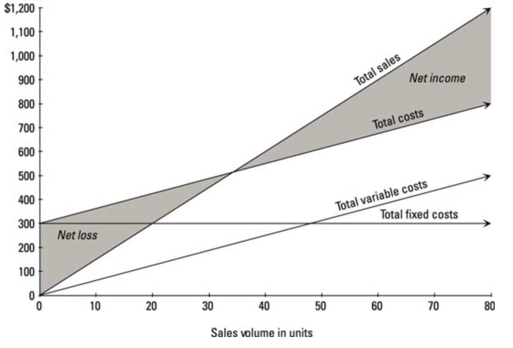

The figure shows when the company will earn net income or incur a loss. When the sales curve exceeds total costs, the company earns net income (represented by the shaded right side of the X). However, if total sales is too low to exceed total costs, then the company incurs a net loss (the shaded left side of the X).

The higher the sales volume — that is, the more sales volume moves to the right of the graph — the higher the company’s net income.

Dropping numbers into the chart shows exactly how much income can be earned at different sales levels. Assuming Pemulis has a sales price of $15 per unit, a variable cost per unit of $6, and total fixed costs of $300, what happens if Pemulis sells 60 basketballs?

Total sales come to $900 (60 units x $15). Total variable costs multiply to $360 (60 units x $6). Add these total variable costs to total fixed costs of $300 to get total costs of $660.

Total sales ($900) sits on the Total sales line. Total costs ($660) sits on the Total cost line. The difference between these amounts ($240) represents the net income from selling 60 units.

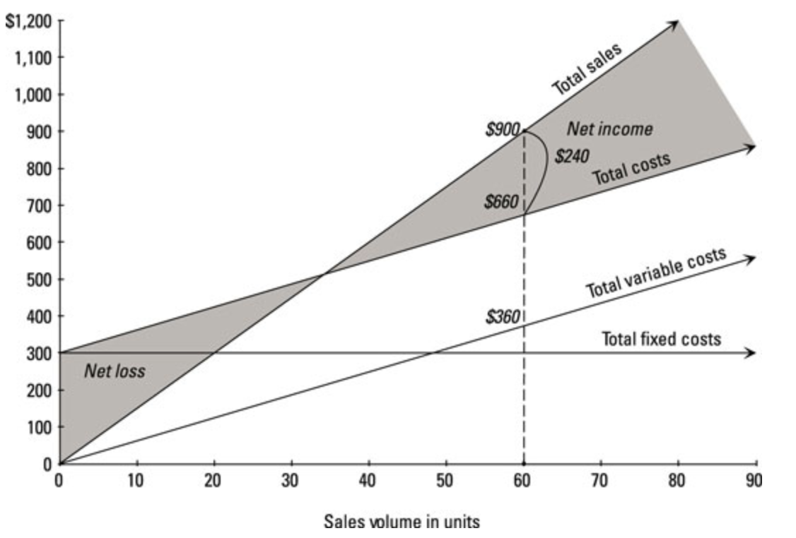

#### Try out the total contribution margin formula

The following formula, based on total contribution margin, follows the same structure as the contribution margin income statement.

`Net income = Total contribution margin – Fixed costs`

>Assume that Pemulis Basketballs sells 60 units for $15 each for total sales of $900. The variable cost of each unit is $6 (so total variable costs come to $6 x 60, or $360), and total fixed costs are $300. Using the contribution margin approach, you can find the net income in two easy steps.

1. Calculate total contribution margin.

  Use the formula to compute total contribution margin, subtracting total variable costs from total sales:

  `Total contribution margin = Total sales – Total variable costs = (60 x $15) – (60 x $6) = $540`

This total contribution margin figure indicates that selling 60 units increases net income by $540.

2. To calculate net income, subtract the fixed costs from the total contribution margin.

  Just plug in the numbers from Step 1:

  `Net income = Total contribution margin – Fixed costs = $540 – $300 = $240`

Subtracting fixed costs of $300 from total contribution margin of $540 gives you net income of $240.

#### The contribution margin per unit formula

If you know the contribution margin per unit, the following approach lets you use that information to compute net income. Here’s the basic formula equating net income with contribution margin per unit:

`Net income = (Sales volume x Contribution margin per unit) – Fixed costs`

>Say Pemulis Basketballs now wants to use this formula. It can simply plug in the numbers — 60 units sold for $15 each, variable cost of $6 per unit, fixed costs of $300 — and solve. First compute the contribution margin per unit:

`Contribution margin per unit = Sales price per unit – Variable costs per unit = $15 – $6 = $9`

Next, plug contribution margin per unit into the net income formula to figure out net income:

`Net income = (Sales volume x Contribution margin per unit) –Fixed costs = (60 x $9) – $300 = $240`

#### The contribution margin ratio formula

If you want to estimate net income but don’t know total contribution margin and can’t find out the contribution margin per unit, you can use the contribution margin ratio to compute net income.

>You can compute contribution margin ratio by dividing total contribution margin by total sales. So if your contribution margin is 540 and your sales is 900, your contribution margin ratio is 60 percent:

This means that 60 cents of every sales dollar directly increases net income. After you know the contribution margin ratio, you’re ready for the net income formula:

`Net income = (Sales x Contribution margin ratio) – Fixed costs`

To calculate net income for the earlier example company, plug the contribution margin ratio of 60 percent into the formula:

`Net income = (Sales x Contribution margin ratio) –Fixed costs = (900 x 60%) – $300 = $240`

**Terminology**

* **Fixed costs**: Expenses incurred on a regular basis, such as monthly rent, utilities, and employee salaries.
* **Variable costs**: Expenses that move up and down in response to production output.
* **Contribution Margin**: The amount of revenue that covers the variable costs and is able to cover the fixed costs.
Calculation
* `Total Contribution Margin = Total Sales Revenue - Total Variable Cost`

* `Contribution Margin Per Unit: Total Contribution Margin / Number of Units Sold`

[Contribution Margin](./Misc/smoothierock-marginquizzes.xlsx)

#### Recap:
* `**Contribution Margin Per Unit** = (Revenue - Variable Costs) / Total units sold`
* **Total Contribution Margin** =
* Variable costs include costs that change with the number of units produced. For instance, cost of raw materials, cost of services provided.
* It is particularly helpful for companies to determine the pricing of their product, in other words, find the break even point where the pricing will also cover fixed costs and provide profit.

**Additional Resource**

* This interview captured in the [Harvard Business Review](https://hbr.org/2017/10/contribution-margin-what-it-is-how-to-calculate-it-and-why-you-need-it) provides a thorough but easy read about Contribution Margin.

* Check out this link for [Contribution Margin](https://www.dummies.com/business/operations-management/how-to-prepare-a-cost-volume-profit-analysis/) that provides an excellent explanation for how Contribution Margin is derived. It also explains other ways to calculate contribution margin.

## [Distribution of the Data](https://www.youtube.com/watch?v=8atMcQpZoAo)

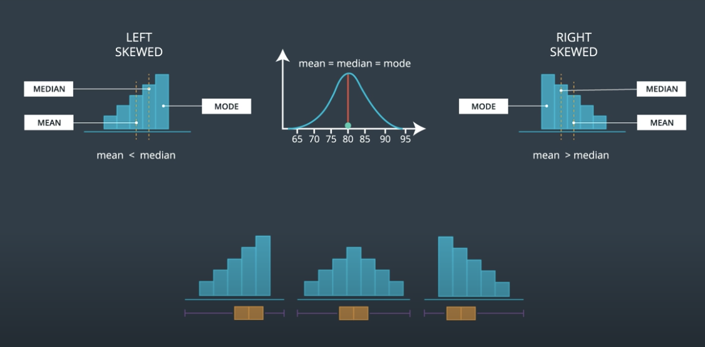

[Let's see a concrete example of what data distribution would look like when using business metrics data.](https://www.youtube.com/watch?v=kdzchZAVlPs)

**Quiz**
The following box plot shows the data distribution and five number summary for the conversion rates for each of 4 market segments. Looking at the east and southwest regions, we can tell we are working with skewed data, and we should pay attention to the positively skewed distributions for both regions and wide distribution of the east coast data.

If you need a reminder about box plots and how to interpret them, you can visit the "Box Plots" concepts in the previous "Spreadsheets 4: Visualize Data" lesson in this course.

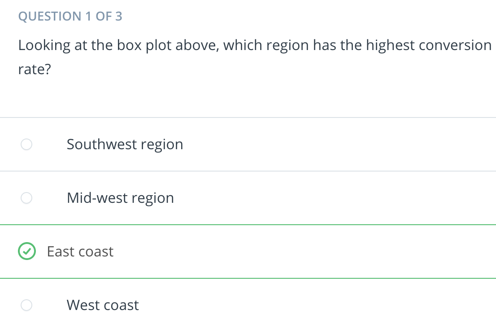

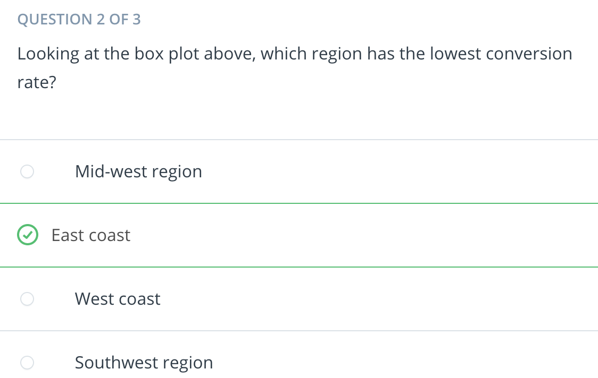

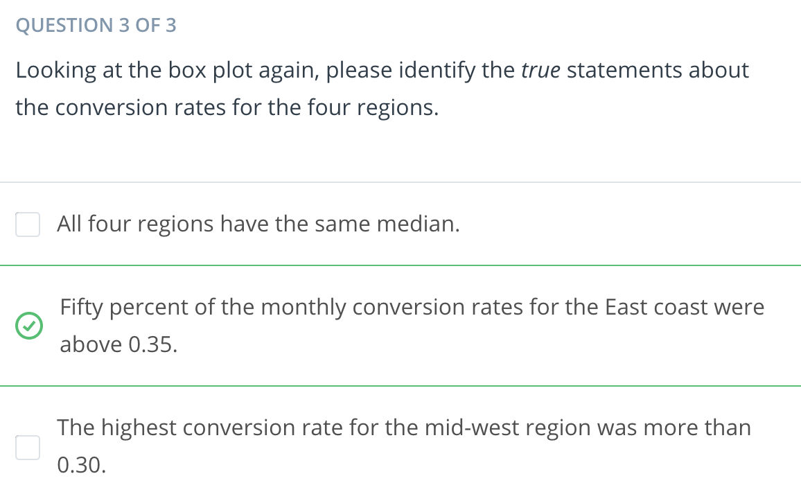

#### Recap:
* Critical to look at the measures of central tendency to talk more about the nuances in the data, compare specific segments and slices in the data to the average or median.

* Without looking at the distribution, we can make the mistake of examining and making conclusions based only on the average.

## [Grouping the Data](https://www.youtube.com/watch?v=LU2JB9R5a6I)

#### [Example](https://www.youtube.com/watch?v=1nY-5dZNdo8)

#### Recap:

* Always slice your data on groups that your data is split into. Depending on your company's market segments, product line and business model, it is important to look at the data split across each of these levels.

* Looking at the distribution allows you to see when and explore why certain spikes happen. For example, it is possible that you have your earliest group or cohort of customers who experienced a new website feature or roll out of specific online app feature. Without keeping an eye on such events, it is hard to make sense of data and explain why you have certain spikes in the data.

* Another benefit of grouping the data is that it allows you to identify more successful cases within your business, marketing and product strategy. This reflection allows you to apply that learning to other segments and groups.

## [Summary](https://www.youtube.com/watch?v=hNve3cMyes0)

You learned a great deal in this lesson, and we hope you feel you have a better sense of how analytics can be used to make better business decisions.

Let's take a moment to summarize the key take-away's from this lesson.

* **Overarching Themes**

* Businesses use **[Key Performance Indicators](#key-performance-indicators)** to track how they are performing on key goals or objectives.

* The **[Marketing Funnel](#marketing-funnel)** captures the various stages in the customer's journey. At the top of the funnel, it captures the impressions, clicks, leads and conversions at the bottom of the funnel.

* Optimizing the funnel refers to maximizing the conversion rate at each level of the funnel.

* The **[Sales Funnel](#sales-metric)** captures the various stages in the sales cycle. At the top of the funnel, it captures the prospects, then the leads and qualified leads, and ends with bookings or closed deals at the bottom of the funnel.

* It is important to look at the distribution of the data to understand if the measures of central tendency represent a normal distribution. Looking at the distribution and measures of central tendency is a critical step of the data analysis process.

* Data should be examined split across cohorts, business cycles, time, product lines, regions and other grouping criteria to fully understand the data. It is critical to slice the data across various factors to make sense of the data and make recommendations.

### Metrics
#### [Marketing]()

* **[Click through rate (CTR)](#click-through-rate-ctr-1)** is an indication of whether the ad campaign is generating enough interest in potential customers. When the CTR increases, it is an indicator of an effective and interesting content in your ad campaign and that maybe you should increase the number of impressions for that ad.

* **[Cost Per Click (CPC)](#cost-per-click-cpc-1)** is an indicator of the cost effectiveness of the ad platform and a useful tool to compare and strategize about which marketing platforms is yielding higher impression and reach and resulting in potential leads.

* **[Cost Per Lead (CPL)](#cost-per-lead-cpl-1)** is an indicator of the cost effectiveness of the ad platform and a useful tool to compare and strategize about which marketing platforms yielded more leads.

* **[Customer Acquisition Cost (CAC)](#customer-acquisition-cost-cac)** is a useful metric used to get an estimate of how much it cost us to acquire the customer in the period the money was spent to reach out to them.
Marketing and Financial

* **[Cost Per Acquisition (CPA)](#cost-per-acquisitioncpa)** allows a business to gauge whether the marketing campaign is generating enough potential leads.

* **[Life Time Value (LTV)](#lifetime-value-ltv)** allows you to focus on audiences and potential customers that will generate higher LTVs with minimum customer acquisition cost. There are several ways to calculate the Life Time Value and it is  **best to calculate the LTV using different ways** to arrive at the average LTV for a customer.

#### [Growth](#growth-metrics)

* **[Stickiness](#stickiness-1)** indicates whether the customers are staying and returning to the website frequently enough. It is a good measure of potential growth of the business.

* **[Churn rate](#churn-rate-1)** is a measure of declining growth and business aim to have a higher growth rate than churn rate. It is a measure of whether the business is retaining the acquired customers.

#### [Financial](#finance-metrics)

* **[The Profit and Loss Statement](#profit--loss-statement-1)**, also called income statement, is one type of financial statement that shows a company's performance and financial position. needed to create the P&L statement are:

* **[Revenue]()** is the money that your company makes from the sales of your products and services

* **[Cost of Goods Sold OR Cost of Sales]()** are the direct costs the company incurs to develop and product the product or service being sold

* **[Gross Profit](#)** is the difference between the revenue and COGS

* **[Selling, General and Administrative expenses]()** capture a wide range of expenses, from administrative, sales commissions, supplies, legal fees, rent, utilities, taxes, and interests. It is used synonymously with Operating expenses. SG&A typically exclude research and development expenses.

* **[Operating Profit]()** is the difference between gross profit and total operating expenses.

* **[Net Income]()** is operating profit minus interest and tax expenses.

* **[Gross Margin](#gross-margin-1)** tells business executives what percentage of each revenue dollar is available to cover operating expenses after the COGS have been accounted for.

* **[Contribution Margin](#contribution-margin-1)** provides the break even point where the pricing of a product will cover fixed overhead costs.

**[Business Metrics Lesson Terminology and Formula](./Misc/business-metrics-lesson-terminology-and-formulas.pdf)**
