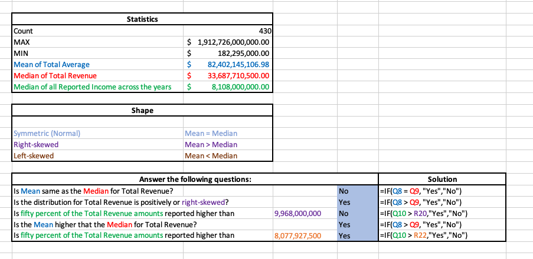
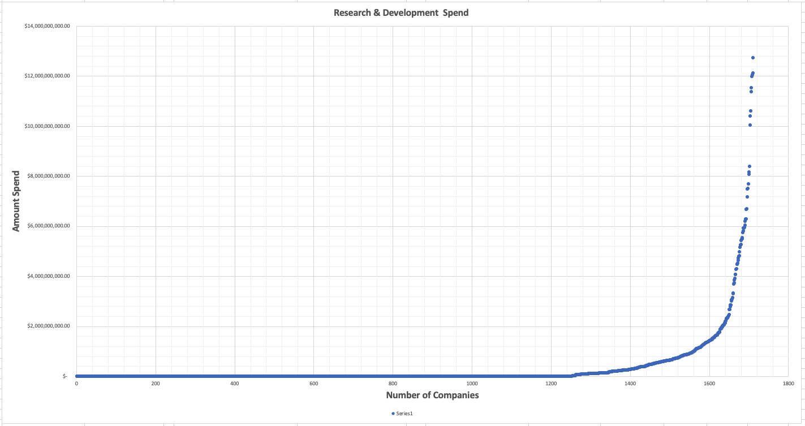
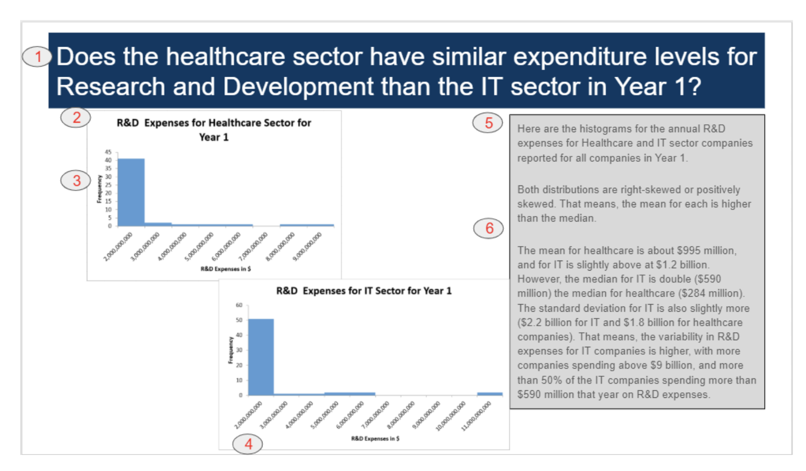

## Analyze NYSE Data

## [How I prepared to tackle this project?](#how-i-prepared)

**Why this Project?**
This project will introduce you to the data analysis process that you will be using throughout the rest of the Nanodegree program. In this project, you will go through the process of calculating summary statistics, drawing an inference from the statistics, calculating business metrics and using models to forecast future growth prospects for the companies. The goal is for you to perform an analysis and also create visual tools to communicate the results in informative ways.

We have provided a clean data set for this project. Although in real life scenarios, data sets often need to be cleaned and processed before analysis can proceed. This project allows you to see what a clean data set should look like.

**Background**:
We used the Fundamentals.csv and Securities.csv files provided by Kaggle. The Fundamentals file provides the fundamental financial data gathered from SEC 10K annual filings from 448 companies listed on the S&P 500 index. The Securities file provided the industry or sector information the companies are categorized under on the S&P 500 index.

**What skills will I use?**

The main goal of this project is for you to demonstrate your ability to:

    * interpret the measures of central tendency and spread (mean, median, standard deviation, range)
    * use a combination of Excel or Google Sheets functions (e.g., IF statements, INDEX and MATCH, calculating descriptive statistics with the IF statement, drop downs, data validation, VLOOKUP).
    * analyze and forecast financial business metrics using Excel or Google Sheets.
    * create visualizations of a business metric and use Excel or Google Sheets to create a financial forecast model.

You will need to create a presentation and spreadsheet to be reviewed. The details of this submission are provided in the last page in this lesson. Pay attention to the details of the [Rubric](https://review.udacity.com/#!/rubrics/2347/view) to assure you have all deliverables. In order to have your presentation reviewed, you will need to save your slides as a PDF. You can save your spreadsheet as a Microsoft Excel workbook or Google spreadsheet.

## Understanding the Data

**Cleaning Up The Data**

Although you do not need to follow these for setting up the dataset, these are some suggestions:

Change all the column names to have no spaces, but still be informative. This isn't necessary, but just a recommendation. Depending on what you do with the data in the future having spaces or special characters in the column names may not work nicely. You will see this in the next content on SQL.
**The following information is included in the Project data NYSE file**:

    * Ticker symbol: Stock symbol
    * Years: Number of years for which data is provided
    * Period ending
    * Total revenue
    * Cost of goods sold
    * Sales, General and Administrative expenses
    * Research and Development expenses
    * Other Operating expense items
    * Global Industry Classification Standard (GICS) Sector: Industry sector the company is categorized under (e.g., American Airlines with the ticker symbol AAL is categorized under Industrials.)
    * GICS Sub Industry: Sub-industry sector the company is categorized under (e.g., AAL is further categorized under the sub-category of Airlines industry.)

Here is the link to the Business Metrics lesson in case you would like to review the material on the [line items within the Income Statement](https://classroom.udacity.com/nanodegrees/nd098/parts/5966ce46-17c7-4491-9856-6fa905d02a83/modules/28f776f2-89c3-417c-8569-41b59a2df372/lessons/b21e37e0-c677-46fa-910a-e11c9ce60723/concepts/98953777-0b46-4466-abd0-31961a5915ee).

### How I prepared:

* I had to answer some quizzes first.

* Given a dataset of NYSE I used pivot tables, to create and isolate certain parts of the data.

* Like getting the mean of total revenues each year.

* I used named ranges to reduce the dragging.

* Created a Statistics Table and Shape Table to answer questions regarding the Data.

> This is Quiz1 worksheet

> Quiz2 worksheet was a challenge, I had to revisit the `Descriptive Statistics` of the lessons.

* Aside from creating the I added I created the `Measures of Center`, `Measures of Center`, `Five Number Summary`, and `Shape` table to answer questions.

> The Note on the bottom was related to the graph...

*I was having trouble getting the graph to map correctly, I noticed that the graph wasn't reading the values if it is `0` so I added `0.01` to get it to map correctly. Note that I'm using a excel for MAC*

*And, If I base my answer on the Shape table and Measures of Center, which will be right-skewed is Mean > Median, but looking at the graph it is obviously extremely left-skewed.*  

* Then Finally, I have to revisit the `Financial Modeling` section of the lesson.

### Instructions:

For the final project, you will conduct three tasks:

  1. complete your own data analysis and create a presentation to share your findings,
  2. develop a dashboard for a Profit and Loss Statement, and
  3. create a Financial Forecasting Model using three scenarios.

You should start by taking a look at your dataset and brainstorming which sub-category and company you want to focus your data analysis on - the questions leading to this page should have assisted in this process!

Then you should use spreadsheets or another Excel-like software to conduct your analysis and choose a sub-category and company you are most interested in. This project is open-ended in that there is no one right answer.

### Project Goals:

Here are the three tasks that you will complete in the final project.

**Task 1:**

a. Identify the question about the data that you will answer based on your data analysis, and include this in your slide presentation.

Your question should include at least one categorical variable (GICS Sector or GICS Sub Industry) and one quantitative variable (one of the financial metrics) and require the use of at least one of the summary statistics.

A tab within the Excel spreadsheet that you submit should include the summary statistics [measures of central tendency (e.g., mean, median) and measures of spread (standard deviation and range)] you used to answer your question.
Deliverable: Slide presentation, Spreadsheet with tab for Summary statistics

b. Your slide presentation should provide at least one visualization to help with your answer.

This visualization might be a bar chart, histogram, scatterplot, box-plot or other visual that you learned to make. Include your insights from the measures of center and spread and at least one numeric summary statistic in the description.

**Deliverable: Slide presentation (includes visualization)**

**Task 2:**

Create a dashboard for a Profit and Loss Statement that calculates the Gross Profit, Operating Profit or EBIT for a company selected from a drop-down list.

Your drop-down list should pull historical fundamentals data to create the P&L Statement.

The P&L statement should include the Gross Profit, Operating Profit or EBIT values for all the years there is historical data available for that company in the dataset.

**Deliverable: Spreadsheet with tab for Dynamic P&L statement**

**Task 3:**

Create a financial model for a company (different from Task 2) of your choice that forecasts out the Gross Profit, Operating Profit or EBIT for two more years using three scenarios (Best case, Weak case and Base case).

Your assumptions for revenue growth, gross margin and operating margin should change for each scenario.

The forecasting model should be dynamic for the selection of the case (Weak, Base, Strong). However, the forecasting model can be static for the chosen company sticker symbol.

**Deliverable: Spreadsheet with tab for Forecasting Model**

**Step One - Get Organized**

When you complete your analysis and presentation you’ll want to submit your project. Get organized before you begin. I recommend creating a single folder that will eventually contain:

1. The presentation with the visual and summary
2. The original data set
3. A copy of the spreadsheet workbook you will use to do the analysis for your report that contains at least the following tabs:
4. Data file
5. Summary statistics
6. P&L Statement Dashboard
7. Forecast scenarios

**Step Two - Analyze Your Data**

Look through the Tasks described above and **select the qualitative variable and quantitative variable** you want to focus your analysis on for the various tasks. Then use the .csv file to conduct your data analysis.

**Step Three - Create Your Presentation**

Once you have finished analyzing the data, create a presentation that shares the visual and summary paragraph. The summary paragraph should clearly communicate your findings based on your analysis, and provide visual or numeric values associated with your summary.

SUBMISSION TEMPLATE

The submission template is a Google Slides file. Make a copy of the submission template to complete your project. We suggest you use the layout provided, though it is not a requirement.

**Step Four**

Assemble your Worksheet You will need to include the Excel file with the **summary statistics**, **dashboard** and **financial model scenarios**.

Put your presentation and spreadsheet workbook you used to do the analysis in a folder and zip it. Then submit the zipped folder for your project.

**Step Five - Check the Rubric**

Use the Project Rubric located here. If you see room for improvement, keep working to improve your project.

**Step Six - Assemble your folder ready for submission**

If you are happy with your submission, then you're ready to submit your project. Put your presentation and spreadsheet workbook in a folder and zip it. Then submit the zipped folder for your project.

### Finished Example Slide

The above slide and graphs were generated with the project data and are meant to be examples. You can see how this example slide meets the rubric requirements.

1. Clear question in the title indicating what is being investigated
2. Descriptive title on each chart describing its contents
3. y-axis title
4. x-axis title
5. Detailed insight based on the descriptive statistics.
6. Summary statistics about the data

If you have more questions about what you need in your project, double check the rubric.

### Helpful Ideas

Based on previous project submissions, this page is meant to review some ideas that are commonly missed.

**Plots**
In the last Excel lesson you were introduced to some ways to visually display your data. However, you should know that the plots you can make are tied to different data types. We go over those once again here.

**Plots You Can Use For Categorical Variables**
If you have categorical data, here is a list of the possible univariate (one variable) plots you can make:

  * Bar Chart
  * Pie Chart

**Plots You Can Use For Quantitative Variables**
If you have quantitative data, here is a list of the possible univariate plots you can make:

  * Histogram
  * Box Plot

**Plots to Compare 2 Variables**
If you are interested in comparing two quantitative variables, then the main way to perform this comparison is with a scatterplot. However, if one of the variables is related to time, then a line plot is frequently used.

**Statistics**
**Quantitative Variables**
When describing quantitative variables, it is common to use the statistics discussed earlier:

  * Measures of center - mean, median, mode
  * Measures of spread - standard deviation, range, IQR

**Categorical Variables**
However, when you are analyzing categorical variables, measures of center and spread Do Not make sense.

**In cases of describing categorical variables, you need to use percentages or counts**. Not means, medians, modes, standard deviations, or ranges.

**Important Last Thought**
With this in mind, think of the variable type of the columns you are analyzing, and determine which plots and statistics make sense for your analysis.
