# Basic SQL

### Entity Relationship Diagrams

An **entity relationship diagram (ERD)** is a common way to view data in a database. Below is the ERD for the database we will use from Parch & Posey. These diagrams help you visualize the data you are analyzing including:

* The names of the tables.
* The columns in each table.
* The way the tables work together.

You can think of each of the boxes below as a spreadsheet.


What to Notice
In the Parch & Posey database there are five tables (essentially 5 spreadsheets):

* web_events
* accounts
* orders
* sales_reps
* region

You can think of each of these tables as an individual spreadsheet. Then the columns in each spreadsheet are listed below the table name. For example, the region table has two columns: id and name. Alternatively the web_events table has four columns.


The "crow's foot" that connects the tables together shows us how the columns in one table relate to the columns in another table. In this first lesson, you will be learning the basics of how to work with SQL to interact with a single table. In the next lesson, you will learn more about why these connections are so important for working with SQL and relational databases.


### Map of SQL Content and Project

The skills you learn in the classroom are directly extendable to writing SQL in other environments outside this classroom. For the project at the end of these lessons, you will download a program that will allow you to write code on your local machine. You will then analyze and answer business questions using data associated with a music store by querying their database.

## Lesson Outline

There are three lessons in this Nanodegree aimed at helping you understand how to write SQL queries. If you choose to take the Predictive Analytics Nanodegree or the Data Analyst Nanodegree programs, these three lessons will also be a part of these programs. However, there is also an additional lesson on Advanced SQL also taught by Derek!

The three lessons in this course aim at the following components of SQL:

**SQL Basics** - Here you will get your first taste at how SQL works, and learn the basics of the SQL language. You will learn how to write code to interact with tables similar to the ones we analyzed in Excel earlier. Specifically, you will learn a little about databases, the basic syntax of SQL, and you will write your first queries!

**SQL Joins** - In this lesson, you will learn the real power of SQL. You will learn about Entity Relationship Diagrams (ERDs), and how to join multiple tables together from a relational database. The power to join tables is what really moved companies to adopt this approach to holding data.

**SQL Aggregations** - In this final lesson, you will learn some more advanced features of SQL. You will gain the ability to summarize data from multiple tables in a database.

At the end of these three lessons, you will be ready to tackle the project. The project aims to assure you have mastered these three topics, but you will also see some of the more advanced queries that were not covered in this course. These are just meant to introduce you to the advanced material, but don't feel discouraged if you didn't get these - they were beyond the scope of the class, and they are not required to pass the project!

## Introduction
Before we dive into writing Structured Query Language (SQL) queries, let's take a look at what makes SQL and the databases that utilize SQL so popular.

SQL is a Language. Hence, the last word of SQL being language. SQL is used all over the place beyond the databases we will utilize in this class. With that being said, SQL is most popular for its interaction with databases. For this class, you can think of a database as a bunch of excel spreadsheets all sitting in one place. Not all databases are a bunch of excel spreadsheets sitting in one place, but it is a reasonable idea for this class.

[Why Do Data Analysts Use SQL?](https://www.youtube.com/watch?v=uCNOtUht2Xc) :tv:

There are some major advantages to using traditional relational databases, which we interact with using SQL. The five most apparent are:

1. SQL is easy to understand.
2. Traditional databases allow us to access data directly.
3. Traditional databases allow us to audit and replicate our data.
4. SQL is a great tool for analyzing multiple tables at once.
5. SQL allows you to analyze more complex questions than dashboard tools like Google Analytics.

[Why Do Businesses Choose SQL?](blob:https://classroom.udacity.com/bc2852c5-4bd1-46a0-aad6-4961e642f337) :tv:

**Why Businesses Like Databases**

**1. Data integrity is ensured** - only the data you want entered is entered, and only certain users are able to enter data into the database.

**2. Data can be accessed quickly** - SQL allows you to obtain results very quickly from the data stored in a database. Code can be optimized to quickly pull results.

**3. Data is easily shared** - multiple individuals can access data stored in a database, and the data is the same for all users allowing for consistent results for anyone with access to your database.

[How Databases Store Data](blob:https://classroom.udacity.com/98d10766-724f-469f-8608-7f941238b307) :tv:

A few key points about data stored in SQL databases:

**1.Data in databases is stored in tables that can be thought of just like Excel spreadsheets.**
For the most part, you can think of a database as a bunch of Excel spreadsheets. Each spreadsheet has rows and columns. Where each row holds data on a transaction, a person, a company, etc., while each column holds data pertaining to a particular aspect of one of the rows you care about like a name, location, a unique id, etc.

**2.All the data in the same column must match in terms of data type.**
An entire column is considered quantitative, discrete, or as some sort of string. This means if you have one row with a string in a particular column, the entire column might change to a text data type. This can be very bad if you want to do math with this column!

**3.Consistent column types are one of the main reasons working with databases is fast.**
Often databases hold a LOT of data. So, knowing that the columns are all of the same type of data means that obtaining data from a database can still be fast.

### Types of Databases

**SQL Databases**

There are many different types of SQL databases designed for different purposes. In this course we will use Postgres which is a popular open-source database with a very complete library of analytical functions.

Some of the most popular databases include:

* MySQL
* Access
* Oracle
* Microsoft SQL Server
* Postgres

You can also write SQL within other programming frameworks like Python, Scala, and HaDoop.

**Small Differences**

Each of these SQL databases may have subtle differences in syntax and available functions -- for example, MySQL doesn’t have some of the functions for modifying dates as Postgres. Most of what you see with Postgres will be directly applicable to using SQL in other frameworks and database environments. For the differences that do exist, you should check the documentation. Most SQL environments have great documentation online that you can easily access with a quick Google search.

The article here compares three of the most common types of SQL: SQLite, PostgreSQL, and MySQL.

You will use PostgreSQL for the lessons in this course, but you are not required to download it to your machine. We provide SQL workspaces in the classroom throughout the lessons. You may download PostgreSQL here if you'd like though.

### [Types of Statements](blob:https://classroom.udacity.com/83f9573a-6608-43e8-b3bc-b1ac01c5464c) :tv:

The key to SQL is understanding statements. A few statements include:

**1. CREATE TABLE** is a statement that creates a new table in a database.
**2. DROP TABLE** is a statement that removes a table in a database.
**3. SELECT** allows you to read data and display it. This is called a query.

The **SELECT** statement is the common statement used by analysts, and you will be learning all about them throughout this course!

SQL statements are code that can read and manipulate data. Basic syntax reminders: ***SQL isn't case sensitive*** - meaning you can write upper and lower case anywhere in the code. Additionally, you can end SQL statements with a semicolon, but ***some SQL environments don't require a semicolon at the end***.

>We will be using the SELECT statement, which is called a query. The DROP and CREATE statements actually change the data in the database. In most companies, analysts are not given permission to use these types of statements. This a good thing - ACTUALLY changing the data in the database is a powerful thing. This is generally reserved for database administrators exclusively.

### [SELECT & FROM](blob:https://classroom.udacity.com/46097a12-fef7-45c5-ac98-ad7cc85d9d8e) :tv:

Here you were introduced to the SQL command that will be used in every query you write: **SELECT** ... **FROM** ....

**1. SELECT** indicates **which column(s)** you want to be given the data for.

**2. FROM specifies from which table(s)** you want to select the columns. Notice the columns need to exist in this table.
If you want to be provided with the data from all columns in the table, you use "\*", like so:

**SELECT * FROM** orders
Note that using **SELECT does not create a new table** with these columns in the database, it just provides the data to you as the results, or output, of this command.

You will use this SQL SELECT statement in every query in this course, but you will be learning a few additional statements and operators that can be used along with them to ask more advanced questions of your data.

## My Notes:

I installed PostgreSQL.app.
To start the server `start` and select the database
To create a database from a downloaded sql file run `psql -U <username> -f <sqlfile>.sql -d postgres -x -q`

### [Then I practiced here](https://pgexercises.com/questions/basic/)

### Retrieve everything from a table

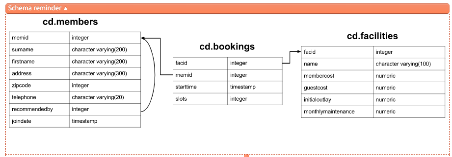

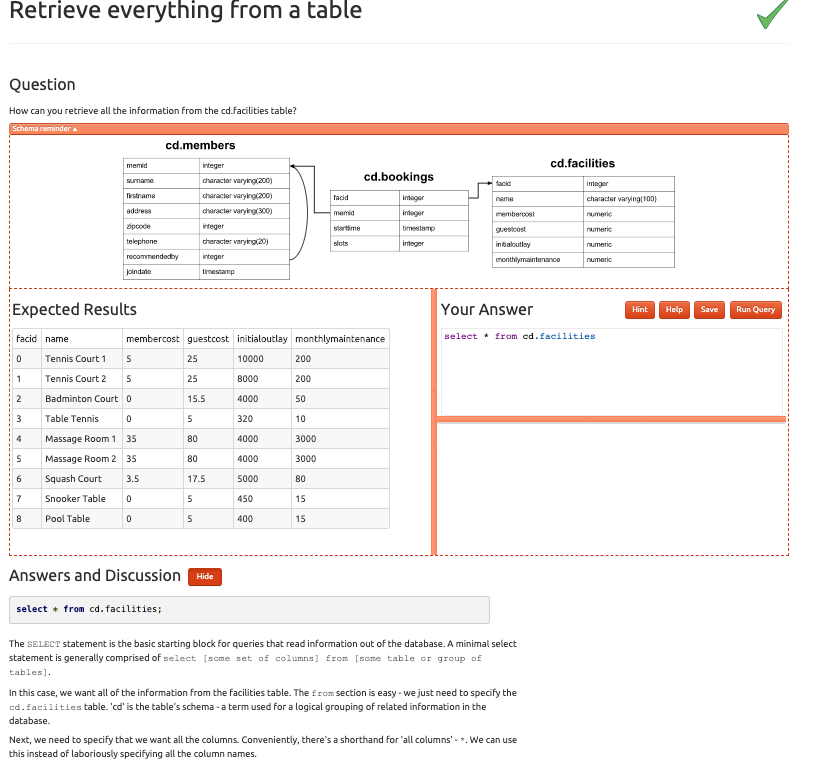

`select * from cd.facilities`

The SELECT statement is the basic starting block for queries that read information out of the database. A minimal select statement is generally comprised of `select [some set of columns] from [some table or group of tables]`.

In this case, we want all of the information from the facilities table. The from section is easy - we just need to specify the `cd.facilities` table. `'cd'` is the table's schema - a term used for a logical grouping of related information in the database.

Next, we need to specify that we want all the columns. Conveniently, there's a shorthand for 'all columns' - \*. We can use this instead of laboriously specifying all the column names.

### Retrieve specific columns from a table

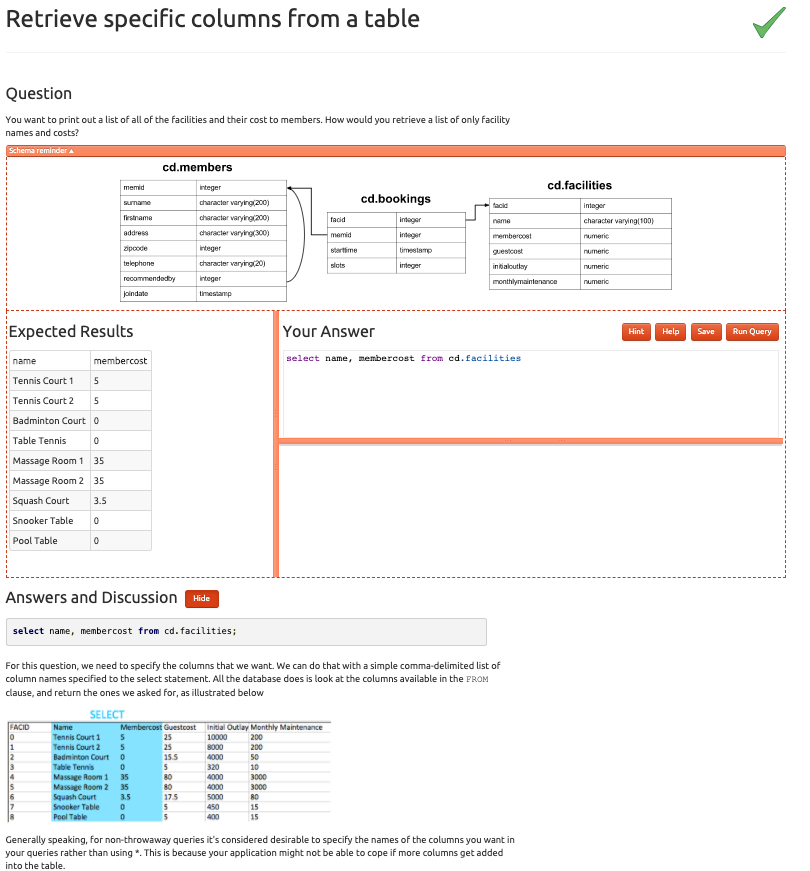

`select name, membercost from cd.facilities;`

For this question, we need to specify the columns that we want. We can do that with a simple comma-delimited list of column names specified to the select statement. All the database does is look at the columns available in the FROM clause, and return the ones we asked for, as illustrated below


Generally speaking, for non-throwaway queries it's considered desirable to specify the names of the columns you want in your queries rather than using \*. This is because your application might not be able to cope if more columns get added into the table.

### Control which rows are retrieved

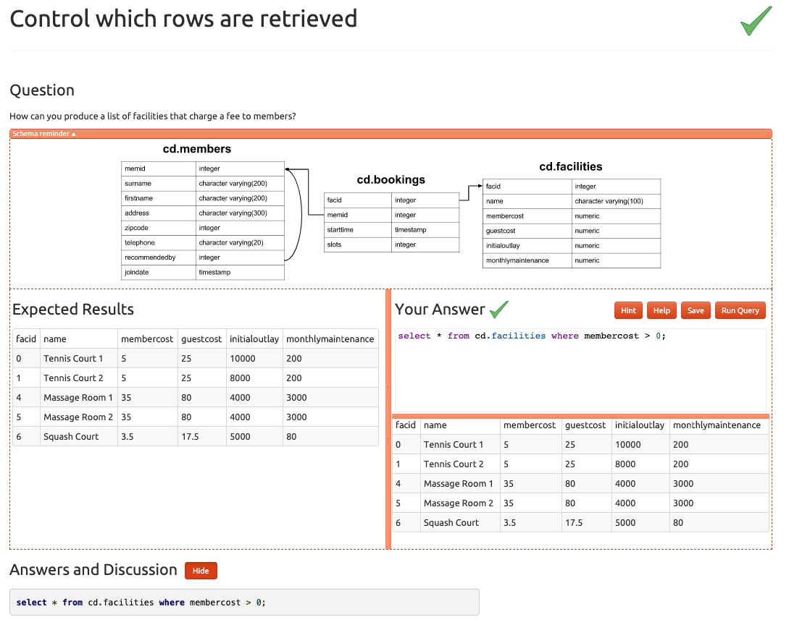

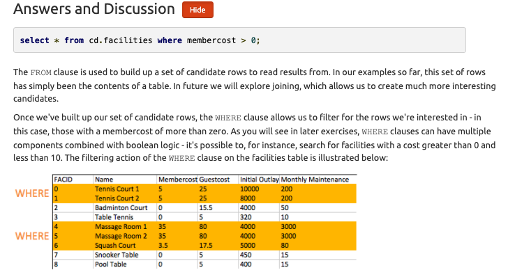

`select * from cd.facilities where membercost > 0;`

The FROM clause is used to build up a set of candidate rows to read results from. In our examples so far, this set of rows has simply been the contents of a table. In future we will explore joining, which allows us to create much more interesting candidates.

Once we've built up our set of candidate rows, the **WHERE** clause allows us to filter for the rows we're interested in - in this case, those with a membercost of more than zero. As you will see in later exercises, WHERE clauses can have multiple components combined with boolean logic - it's possible to, for instance, search for facilities with a cost greater than 0 and less than 10. The filtering action of the WHERE clause on the facilities table is illustrated below:

### Control which rows are retrieved - part 2

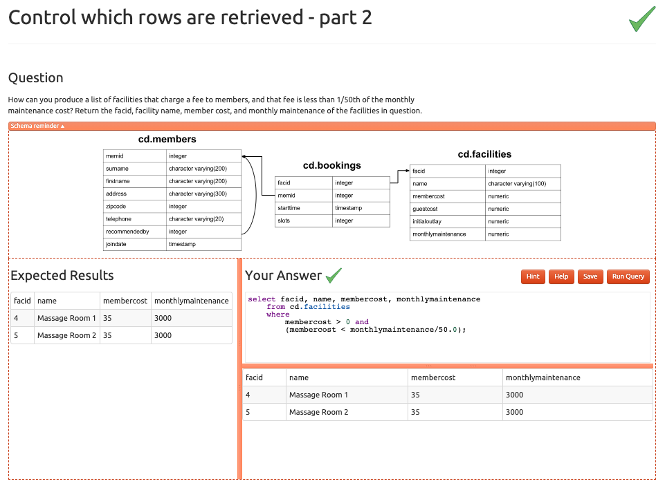

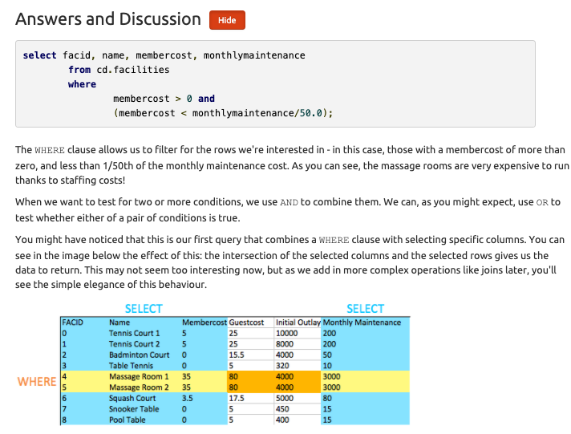

```
  select facid, name, membercost, monthlymaintenance
  	from cd.facilities
  	where
  		membercost > 0 and
  		(membercost < monthlymaintenance/50.0);     
```

The WHERE clause allows us to filter for the rows we're interested in - in this case, those with a membercost of more than zero, and less than 1/50th of the monthly maintenance cost. As you can see, the massage rooms are very expensive to run thanks to staffing costs!

When we want to test for two or more conditions, we use `AND` to combine them. We can, as you might expect, use `OR` to test whether either of a pair of conditions is true.

You might have noticed that this is our first query that combines a WHERE clause with selecting specific columns. You can see in the image below the effect of this: the intersection of the selected columns and the selected rows gives us the data to return. This may not seem too interesting now, but as we add in more complex operations like `joins` later, you'll see the simple elegance of this behaviour.

### Basic string searches

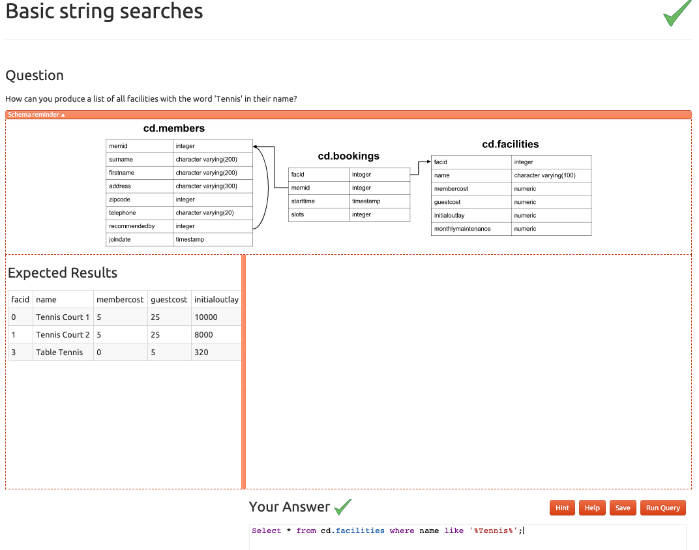

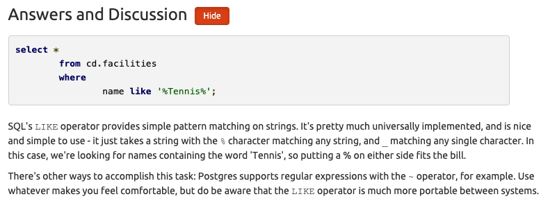

```
  select *
    from cd.facilities
    where
      name like '%Tennis%';  
```

SQL's `LIKE` operator provides simple pattern matching on strings. It's pretty much universally implemented, and is nice and simple to use - it just takes a string with the `%` character matching any string, and _ matching any single character. In this case, we're looking for names containing the word 'Tennis', so putting a % on either side fits the bill.

There's other ways to accomplish this task: Postgres supports regular expressions with the ~ operator, for example. Use whatever makes you feel comfortable, but do be aware that the LIKE operator is much more portable between systems.

### Matching against multiple possible values

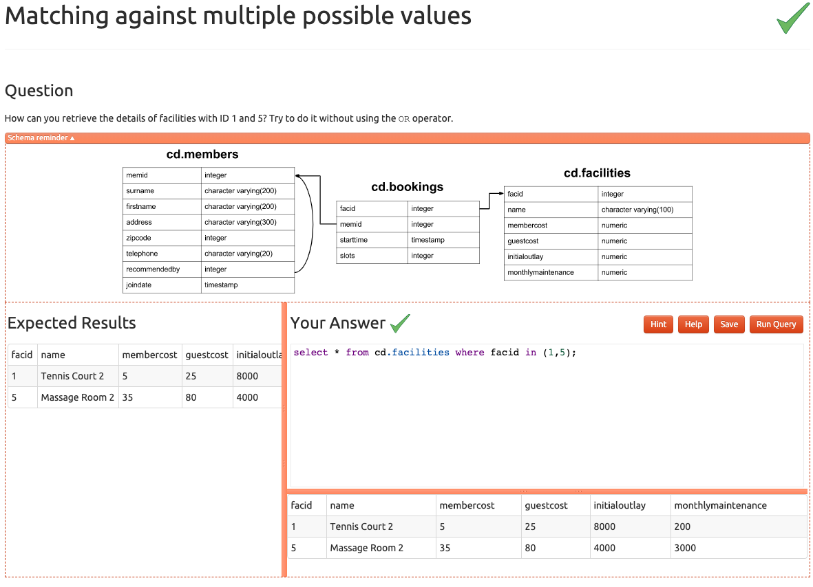

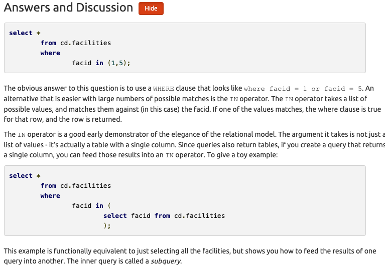

```
  select *
    from cd.facilities
    where
      facid in (1,5);     
```
The obvious answer to this question is to use a WHERE clause that looks like `where facid = 1 or facid = 5`. An alternative that is easier with large numbers of possible matches is the `IN` operator. The `IN` operator takes a list of possible values, and matches them against (in this case) the facid. If one of the values matches, the where clause is true for that row, and the row is returned.

The IN operator is a good early demonstrator of the elegance of the relational model. The argument it takes is not just a list of values - it's actually a table with a single column. Since queries also return tables, if you create a query that returns a single column, you can feed those results into an IN operator. To give a toy example:

```
  select *
  	from cd.facilities
  	where
  		facid in (
  			select facid from cd.facilities
  			);
```

This example is functionally equivalent to just selecting all the facilities, but shows you how to feed the results of one query into another. The inner query is called a *subquery*.
