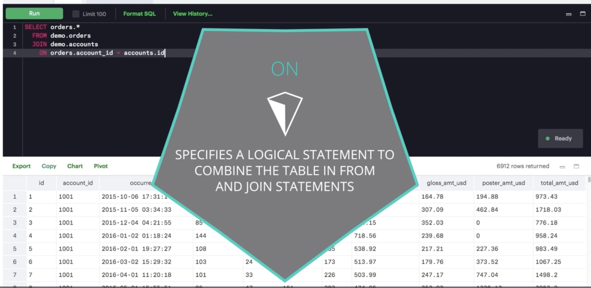
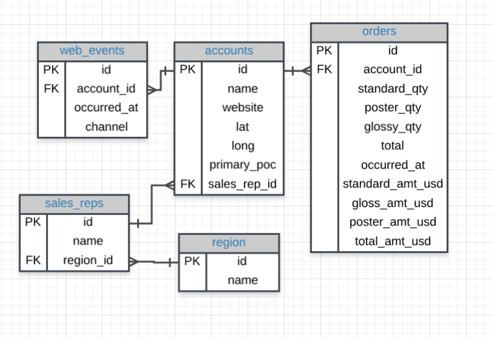

### [Intro](https://www.youtube.com/watch?v=YvZ010GU-Ck) :tv:

[Why Would We Want to Split Data Into Separate Tables?](blob:https://classroom.udacity.com/75dc60dd-b029-438b-905e-cb292694bef2) :tv:

So above, we understand that all of the information related to an account is not in the orders table, but why not? [Watch the below video](blob:https://classroom.udacity.com/bfe5fa46-1321-4cb3-84b2-42d6bce33550) :tv: to find out!

### Database Normalization
When creating a database, it is really important to think about how data will be stored. This is known as **normalization**, and it is a huge part of most SQL classes. If you are in charge of setting up a new database, it is important to have a thorough understanding of database normalization.

There are essentially three ideas that are aimed at database normalization:

1. Are the tables storing logical groupings of the data?
2. Can I make changes in a single location, rather than in many tables for the same information?
3. Can I access and manipulate data quickly and efficiently?

This is discussed in detail [here](https://www.itprotoday.com/sql-server/sql-design-why-you-need-database-normalization).

However, most analysts are working with a database that was already set up with the necessary properties in place. As analysts of data, you don't really need to think too much about data normalization. You just need to be able to pull the data from the database, so you can start making insights. This will be our focus in this lesson.

### [Introduction to JOINs](blob:https://classroom.udacity.com/fb8382c8-f123-41f1-a6fb-24cc6d0e4cc9) :tv:





This entire lesson will be focused on **JOINs**. The whole purpose of **JOIN** statements is to allow us to **pull data from more than one table at a time**.

Again - JOINs are useful for allowing us to pull data from multiple tables. This is both simple and powerful all at the same time.

With the addition of the JOIN statement to our toolkit, we will also be adding the **ON** statement.

We use **ON clause to specify a JOIN condition which is a logical statement to combine the table in `FROM` and `JOIN` statements**.

#### Write Your First JOIN
Below we see an example of a query using a JOIN statement. Let's discuss what the different clauses of this query mean.

```
  SELECT orders.*
  FROM orders
  JOIN accounts
  ON orders.account_id = accounts.id;
```
As we've learned, the `SELECT` clause indicates which column(s) of data you'd like to see in the output (For Example, orders.* gives us all the columns in orders table in the output). The `FROM` clause indicates the first table from which we're pulling data, and the `JOIN` indicates the second table. The `ON` clause specifies the column on which you'd like to merge the two tables together. Try running this query yourself below.

**What to Notice**
We are able to pull data from two tables:

1. **orders**
2. **accounts**

Above, we are only pulling data from the **orders** table since in the **SELECT** statement we only reference columns from the orders table.

The **ON** statement holds the two columns that get linked across the two tables. This will be the focus in the next concepts.

**Additional Information**

If we wanted to *only pull individual elements from either the orders or accounts table, we can do this by using the exact same information* in the **FROM** and **ON** statements. However, in your SELECT statement, you will need to know how to specify tables and columns in the SELECT statement:

1. The **table name** is always **before** the period.
2. The **column** you want from that table is always **after** the period.

For example, if we want to pull only the **account name** and the dates in which that account placed an order, but none of the other columns, we can do this with the following query:

```
  SELECT  accounts.name,
          orders.occurred_at
  FROM orders
  JOIN accounts
  ON orders.account_id = accounts.id;
```

This query only pulls two columns, not all the information in these two tables. Alternatively, the below query pulls all the columns from both the **accounts** and **orders** table

```
  SELECT *
  FROM orders
  JOIN accounts
  ON orders.account_id = accounts.id;
```
And the first query you ran pull all the information from only the **orders** table:

```
  SELECT orders.*
  FROM orders
  JOIN accounts
  ON orders.account_id = accounts.id;
```

Joining tables allows you access to each of the tables in the **SELECT** statement through the table name, and the columns will always follow a . after the table name.

#### Exercises:
1. Try pulling all the data from the **accounts** table, and all the data from the **orders** table.
```
  SELECT  accounts.*,
          orders.*
  FROM accounts
  JOIN orders
  ON accounts.id = orders.account_id;
```

2. Try **pulling standard_qty**, **gloss_qty**, and **poster_qty** from the **orders** table, and the **website** and the p**rimary_poc** from the **accounts** table.
```
  SELECT	orders.standard_qty,
  		orders.gloss_qty,
          orders.poster_qty,
          accounts.website,
          accounts.primary_poc
  FROM orders
  JOIN accounts
  ON orders.account_id = accounts.id;
```
> Notice that we need to specify every table a column comes from in the SELECT statement.

### Entity Relationship Diagrams

From the last lesson, you might remember that an entity relationship diagram (ERD) is a common way to view data in a database. It is also a key element to understanding how we can pull data from multiple tables.

It will be beneficial to have an idea of what the ERD looks like for Parch & Posey handy, so I have posted it again below. You might even print a copy to have with you as you work through the exercises in the remaining content.



**Tables & Columns**
In the Parch & Posey database there are 5 tables:

**web_events**
**accounts**
**orders**
**sales_reps**
**region**
You will notice some of the columns in the tables have PK or FK next to the column name, while other columns don't have a label at all.

If you look a little closer, you might notice that the **PK** is **associated with the first column in every table**. The PK here stands for **primary key**. A primary key exists in every table, and it is a **column that has a unique value for every row**.

If you look at the first few rows of any of the tables in our database, you will notice that this first, **PK, column is always unique**. *For this database it is always called `id`, but that is not true of all databases*.

You can explore the database ERD below by clicking on the table names in the left menu of the workspace below. Or you can query the first row of these tables in the workspace to see some examples of the content inside of each field.
