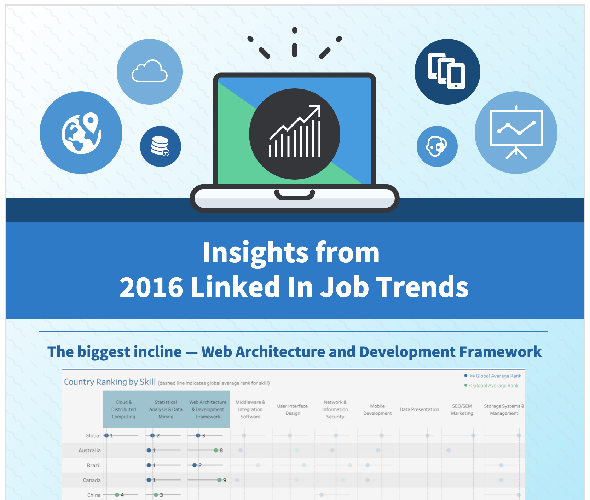

# Interpret a Data Visualization

#### [Back to homepage](https://m-soro.github.io/Business-Analytics/)

## [Skip to my Project](#my-project)

### Introduction

In order for you to see how data is being used across many industries, you will hear from three individuals from greatly differing industries.

Once you hear from Mitch, Emily, and Phil you will be ready to take on your first project. Following each story, there is a short activity. These activities do not need to be submitted as a part of the project, but are a part of introducing you to the tools you will be learning about throughout this program!

Similar to the examples, your first project will include data from three entirely different use cases. There are three goals for this first project:

1. Begin building your data intuition by looking at data dashboards and drawing insights for yourself.

2. Understand how the Udacity review system works. The project review system is one of the absolute best aspects of being a Udacity student, and it is the key to becoming a Nanodegree graduate. You must pass all the projects!

3. Glimpse into your future. By the end of this program, you will not only be able to draw conclusions from these dashboards, but you will be able to build dashboards for yourself just like the ones you see here in the first project!

The aim of this whole project is mostly to show you the Udacity process, but it is still required!

[Project Introduction](blob:https://classroom.udacity.com/9ea58902-3fda-4c4f-b3e6-d53612343732)
>This project is aimed at analysis using data visualization in Tableau. Watch the video here to learn what your project is all about!

### Project Overview

Project description

A large part of working with data is being able to interpret data visualizations and explain your insights to others. To give you some practice with this, we’ve selected a few Tableau dashboards for you to explore.

The links are below, under "Choose from these Dashboards." Choose one of these dashboards, whichever one interests you the most, and find three insights in the visualizations.

For each insight:

- [ ] Provide a static image that shares what you found.
- [ ] Write a short report explaining each observation and
- [ ] How you found the information to reach your conclusion from the dashboard.
- [ ] Altogether (including images), your report should be 1-2 pages.

[LinkedIn Top Skills](https://public.tableau.com/profile/matt.chambers#!/vizhome/LinkedInTopSkills2016-MakeoverMonday/LinkedInTopSkills2016-MakeoverMonday)

[Project Rubric](https://review.udacity.com/#!/rubrics/1063/view)

## [My Project](https://venngage.net/ps/br2YNur10Ew/interpret-a-data-visualization)

## [See it here](https://venngage.net/ps/br2YNur10Ew/interpret-a-data-visualization) :rocket:

[Back to top](#)
