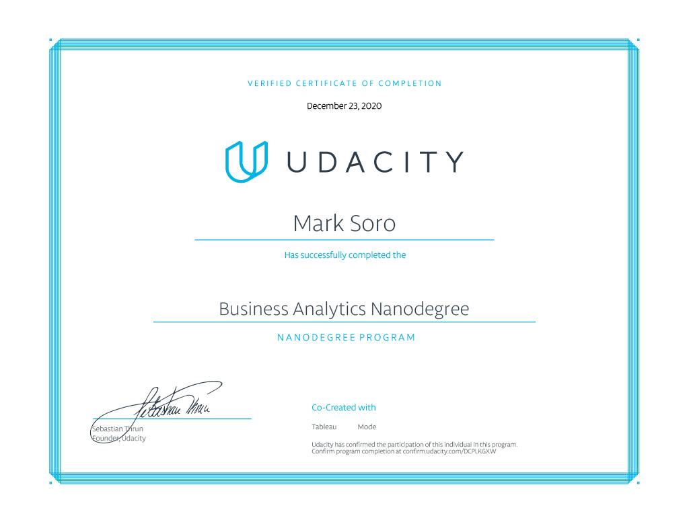

# Business Analytics

This program aims to develop foundational data skills. Analyze data using Excel, query a database using SQL and build interactive dashboards and visualizations in Tableau.

To successfully complete this course, four mentor reviewed projects are required and one must satisfy the project's rubric.

#### [Course Syllabus](https://d20vrrgs8k4bvw.cloudfront.net/documents/en-US/Business+Analytics+Nanodegree+Program+Syllabus+2.0.pdf)

## [Welcome to the Program](#)

Introduction to the program about where and how data applies to a variety of industries. First project is to interpret a data visualization.

#### :dart: [PROJECT - Interpret a Data Visualization](Welcome-to-the-Nanodegree-Program/README.md)

>In this project, you’ll explore an interactive data dashboard to uncover insights. You’ll write a short report explaining each insight, and how you found the information to reach your conclusion from the dashboard.

[Project Rubric](Welcome-to-the-Nanodegree-Program/rubric1.pdf) :heavy_check_mark:

## [Introduction to Data](Introduction-to-Data/README.md)

Using descriptive statistics and visualizations in Excel this section aims to develop and communicate insights discovered from the data. This section also teaches more advanced excel functions, builds excel models and statistical analysis. The project at the end of the lesson is to analyze data from NYSE.

#### :dart: [PROJECT - Analyze NYSE Data](Introduction-to-Data/L9-Project-Analyze-NYSE-Data/README.md)

>In this project, you'll use statistics and spreadsheet programs like Excel to analyze data from over 500 companies on the New York Stock Exchange. You'll also forecast financial metrics based on three possible scenarios for a company of your choice from the NYSE dataset.

[Project Rubric](Introduction-to-Data/L9-Project-Analyze-NYSE-Data/Misc/rubric2.pdf) :heavy_check_mark:

## [SQL for Data Analysis](SQL-for-Data-Analysis/README.md)

Extract and analyze a data set using SQL. Use data gathered from a query result to find answers to business questions and visualize it to make it easier to understand. The project in this section is to analyze a digital music store in how data gathered from their database may help the company.

#### :dart: [PROJECT - Query a Digital Music Store Database](SQL-for-Data-Analysis/L4-Project-Query-Music-Store/README.md)

>In this project, you will query a digital music store database which holds information regarding the store’s media, employees, and customers. You will use the database to help the store gain an understanding of the types of music that are purchased, where customers live, and how the company might optimize their business practices.

[Project Rubric](SQL-for-Data-Analysis/L4-Project-Query-Music-Store/Misc/rubric3.pdf) :heavy_check_mark:

## [Data Visualization](Data-Visualization/README.md)
This section takes data visualizations to another level. Use Tableau to analyze and visualize large data sets, and create informative and dynamic data dashboards. This section makes it easier to visualize large data sets in a more readable form in order to present insights to all business areas.

#### :dart: [PROJECT- Build Data Dashboards](Data-Visualization/L5-Project-Build-Data-Dashboard/README.md)

>In this project, you’ll build interactive dashboards with Tableau and use them to discover and communicate insights from data. You’ll use a dataset of flight delays in the US to visualize the quality of airlines and airports, find the best times to fly, and more.

[Project Rubric](Data-Visualization/L5-Project-Build-Data-Dashboard/Misc/rubric4.pdf) :heavy_check_mark:

---

## [Certificate of Completion](https://confirm.udacity.com/DCPLKGXW)

---

**Acknowlegement**

Thanks to :raised_hands: [Udacity](https://www.udacity.com/) :raised_hands: for providing this [scholarship](Welcome-to-the-Nanodegree-Program/scholarship.pdf) :tada: course.
